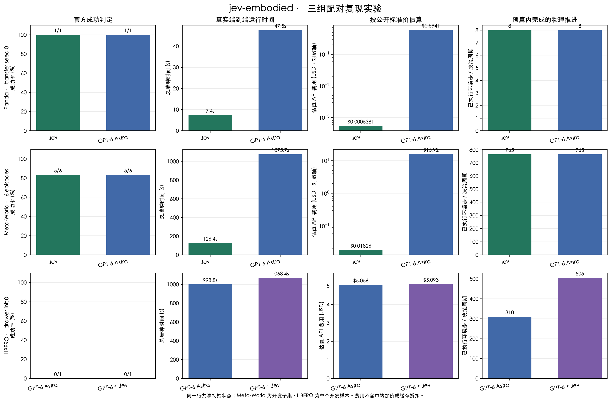
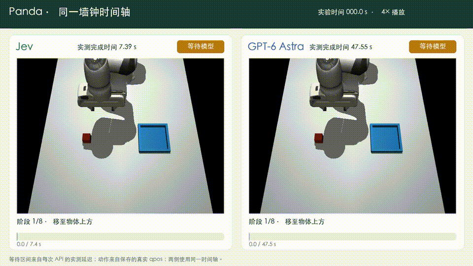
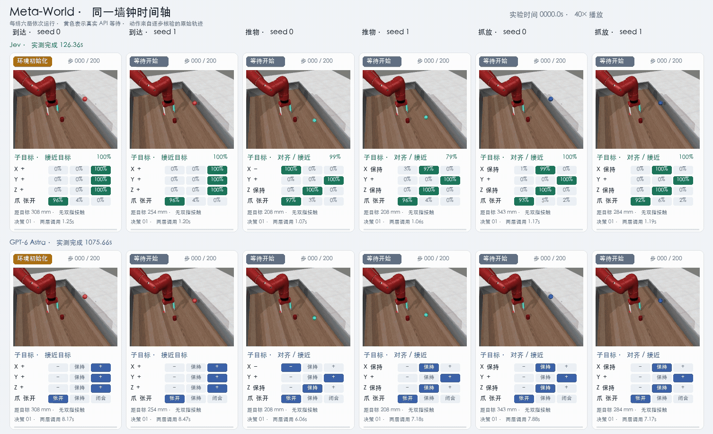
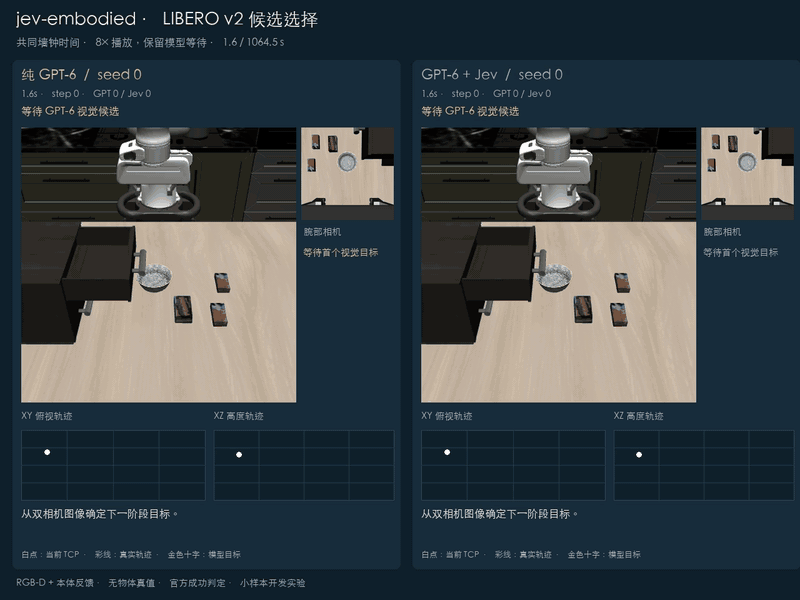

# jev-embodied

本机具身智能评测平台，用同一初始状态比较 Jev、纯 GPT-6 Astra，以及 GPT-6 Astra + Jev。当前接通 MuJoCo Panda、Meta-World 和 LIBERO；成功只采用仿真环境的物理判定，失败与超时同样保留。

## 当前结论

**现有小样本没有证明 Jev 能提高任务成功率，但明确显示它适合替代昂贵、缓慢的结构化局部决策。** Panda 配对单局和 Meta-World 六局中，两种方法成功数相同，Jev 分别快 6.4 倍和 8.5 倍；LIBERO 两种方法都未完成，不能作成功率结论。



| 环境与配对范围 | Jev 路线 | 纯 GPT 路线 | 可支持的结论 |
|---|---:|---:|---|
| Panda `transfer` seed 0 | 1/1；7.39 s；$0.000538 | 1/1；47.55 s；$0.5941 | 成功相同；Jev 快 6.4×，估算费用低约 1104× |
| Meta-World 3 任务 × 2 seeds | 5/6；126.36 s；$0.0183 | 5/6；1075.66 s；$15.9184 | 成功相同；Jev 快 8.5×，估算费用低约 872× |
| LIBERO 关闭抽屉 init 0 | GPT 候选 + Jev：0/1；1068.40 s；$5.0931；505 步 | 0/1；998.84 s；$5.0562；310 步 | 两组都失败；相近预算下混合组推进更多，但没有效果提升证据 |

费用按 Jev 输入 `$0.042 / 1M`、GPT-6 Astra 输入/输出 `$10 / $50 / 1M` 估算，不代表中转平台账单。

[完整指标、失败原因与协议](docs/results/reproduction-fixed-2026-09-24/RESULTS.md) · [绘图原始数据](docs/results/reproduction-fixed-2026-09-24/final-overview-v2/metrics.json)

## 实验与视频

### 1. Panda：高层技能选择

两组使用相同 MuJoCo 场景和 seed 0，模型选择离散技能，代码控制器执行连续运动。两组都成功；另一次 Jev 开发集运行为 3 个任务 × 3 seeds、9/9 成功，但不与 GPT 单局混算。



[墙钟对照 MP4](docs/results/reproduction-fixed-2026-09-24/panda/wallclock-comparison.mp4) · [Jev 单独轨迹](docs/results/reproduction-fixed-2026-09-24/panda/jev-transfer.mp4) · [GPT 单独轨迹](docs/results/reproduction-fixed-2026-09-24/panda/gpt-transfer.mp4)

动图用同一个实验时钟做 4× 播放：黄色表示等待 API，绿色/蓝色表示执行保存的真实 qpos。Jev 在 7.39 秒完成并保持末帧，GPT-6 Astra 到 47.55 秒完成，因此 6.4× 的端到端差异直接体现在画面中。

### 2. Meta-World：结构化分层控制

固定 `reach-v3`、`push-v3`、`pick-place-v3`，每项两个 seeds。两组共享六个初始状态、200 步与 80 次调用上限；两者都在 `push-v3` seed 0 达到步数上限，其余 5 局成功。回放由保存动作重新执行，12 条轨迹的每一步观测与成功标记误差均为 0。



[墙钟对照 MP4](docs/results/reproduction-fixed-2026-09-24/metaworld/paired-wallclock.mp4) · [按环境步核对的原回放](docs/results/reproduction-fixed-2026-09-24/metaworld/paired-grid.mp4) · [详细统计图](docs/results/reproduction-fixed-2026-09-24/metaworld/comparison/comparison.png) · [逐局 CSV](docs/results/reproduction-fixed-2026-09-24/metaworld/comparison/episodes.csv)

动图让每排六局依次运行，并在同一实验时钟上做 40× 播放；黄色明确显示保存记录中的 API 等待。Jev 六局在 126.36 秒完成，GPT-6 Astra 用时 1075.66 秒，8.5× 的端到端差异没有被轨迹同步抹掉。

### 3. LIBERO：视觉规划 + 局部控制

两组共享 GPT 双相机时序视觉候选生成器和同一代码伺服器；纯 GPT 或 Jev 分别选择候选及正常/谨慎速度。之前第一步的越界像素会直接终止，本轮同时加入几何验证反馈、读取超时和瞬时 429/5xx/529 的动作前重试。

纯 GPT 在 310 步达到 `$5` 费用保护；GPT + Jev 在近似费用下执行了 505 步，也达到费用保护。两条轨迹都没有通过 LIBERO 官方成功判定，因此这项实验只说明混合路线单位预算推进更多，不能说明 Jev 提高成功率。



[观看包含模型等待的配对 MP4](docs/results/reproduction-fixed-2026-09-24/libero/drawer-supervisor-v2/comparison.mp4)

README 动图为约 32× 墙钟时间回放；MP4 为 8×，两者都保留模型等待区间，未补造中间轨迹。

## 安装与启动

主平台使用 Python 3.12；Meta-World 和 LIBERO 使用独立 Python 3.11 环境，避免依赖冲突。

```bash
git clone https://github.com/zyh3699/jev-embodied.git
cd jev-embodied

conda create -n jev-embodied python=3.12 -y
conda activate jev-embodied
python -m pip install -e '.[video,plots]'

npm ci
npm run build
jev-embodied serve --port 8090
```

浏览器打开 <http://127.0.0.1:8090>，在“模型连接”保存 Jev 与 GPT-6 Astra 配置。API Key 只从本机凭据存储读取，不写入实验结果。

## 复现命令

### Panda

```bash
jev-embodied evaluate \
  --manifest benchmarks/builtin-smoke.json --output runs/panda-gpt \
  --policy chat --connection-source saved \
  --control-mode skills --observation-mode privileged \
  --max-steps 30 --max-calls 60 --timeout 600 --threshold 0 \
  --validation-retries 1 --request-retries 1 --continue-on-error
```

把 `--policy chat` 改为 `--policy jev` 即运行 Jev；完整九局使用 `benchmarks/builtin-dev.json`。

### Meta-World

```bash
python scripts/run_metaworld_hierarchical_comparison.py \
  --output runs/metaworld-paired \
  --worker-python .venv-metaworld/bin/python \
  --plot-python "$(which python)" \
  --validation-retries 1 --request-retries 1
```

### LIBERO

```bash
jev-embodied libero-compare \
  --architecture supervisor-v2 --budget-mode wall-time \
  --manifest benchmarks/libero-drawer-compare.json \
  --worker-python .venv-libero/bin/python --libero-root .sim/LIBERO \
  --output runs/libero-drawer-paired --modes gpt6 gpt6-jev \
  --timeout 1200 --max-usd 5 --action-repeat 5 --action-scale 0.5 \
  --camera-size 384 --validation-retries 2 --request-retries 1 \
  --continue-on-error
```

输出目录必须不存在。完整环境安装和固定版本见 [实验结果说明](docs/results/reproduction-fixed-2026-09-24/RESULTS.md)。

## 指标口径

- 成功：环境官方物理成功判定，不使用模型自评。
- 时间：端到端墙钟时间，包含网络与模型等待。
- 费用：按 API 报告 token 和公开标准价估算；缺失用量不记为 0。
- 对照：同一行必须共享任务、seed 和初始状态；开发子集不冒充正式榜单成绩。
- 媒体：仅由本轮保存的 qpos、动作或相机帧生成；导出时不调用模型。

## 验证

```bash
python -m pytest -q
npm run build
```

项目采用 [MIT License](LICENSE)。实现说明见 [技术指南](docs/TECHNICAL_GUIDE.md)。
