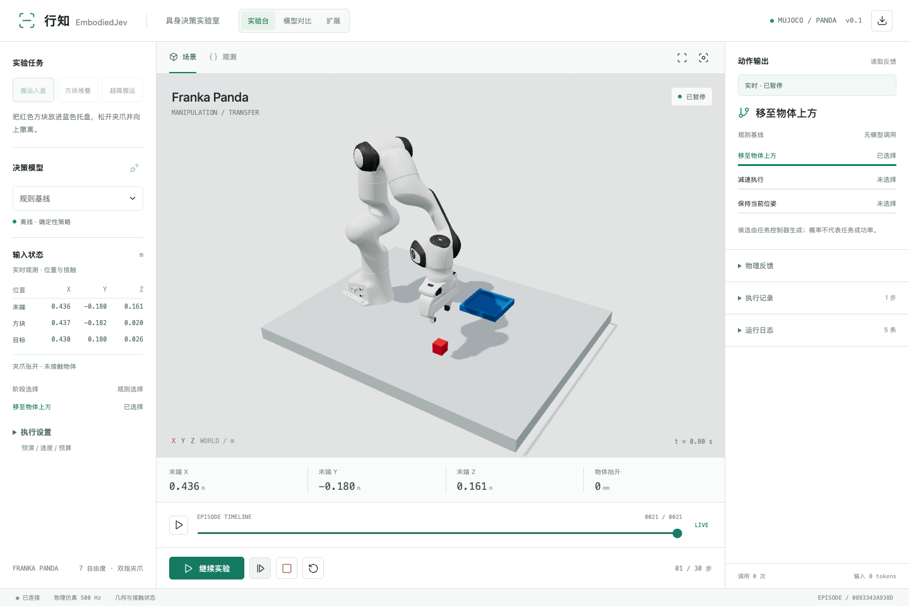
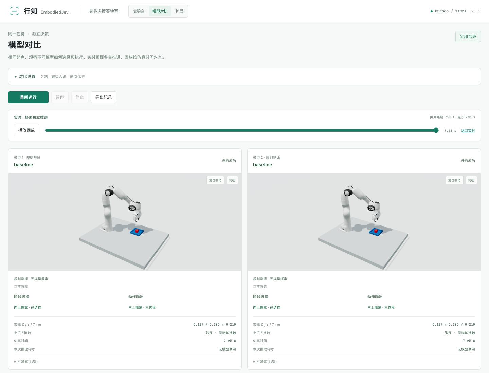
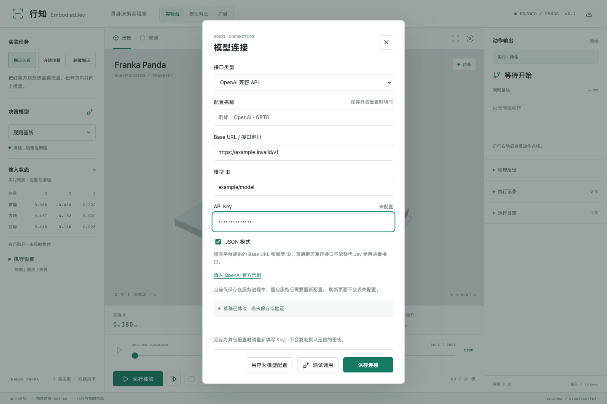
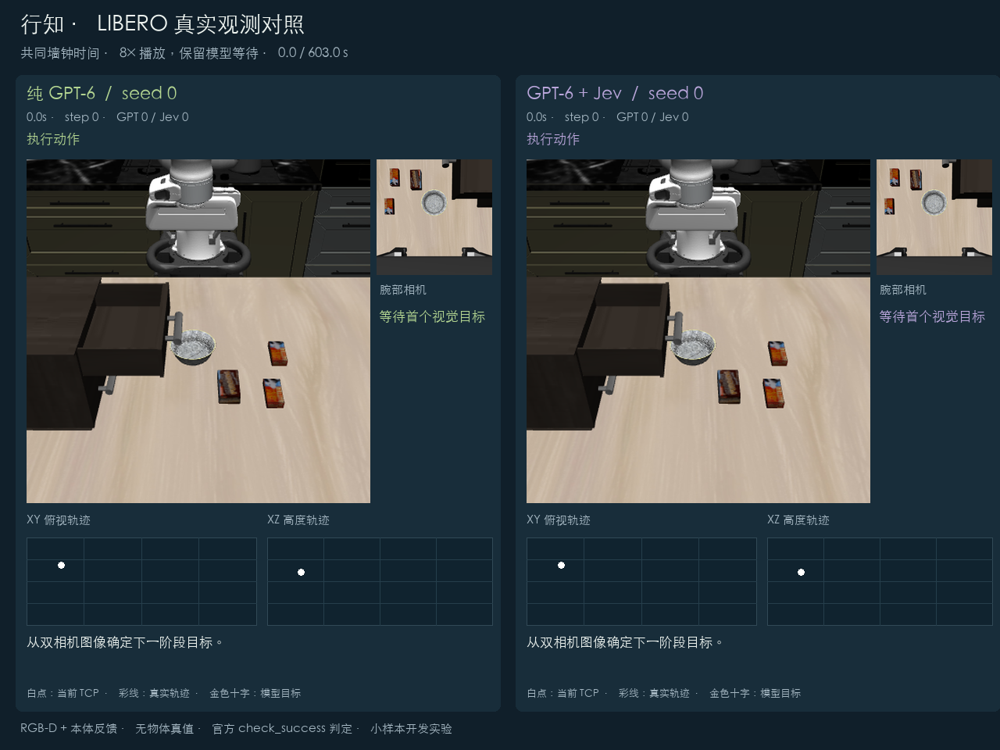
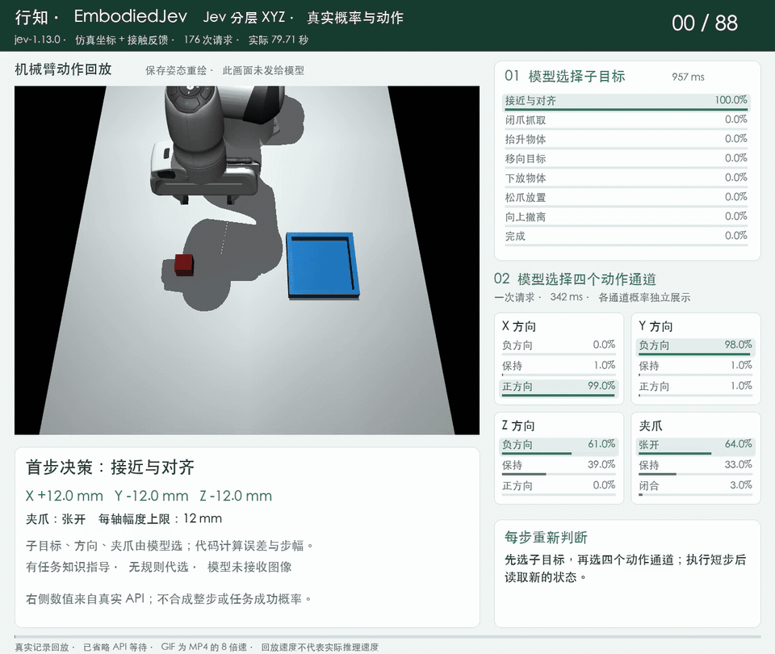
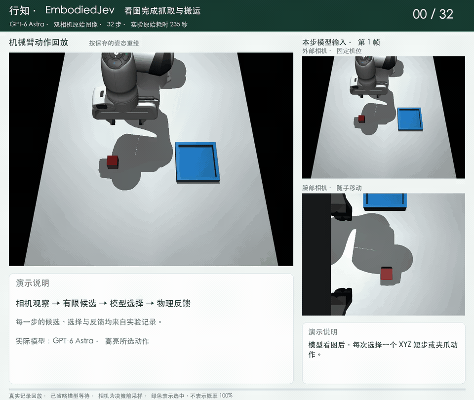

<div align="center">

# 🤖 EmbodiedJev · 行知

## 🌐 [点击进入在线实验展示 →](https://fbddcz.github.io/embodied-jev/)

**🎬 直接看真实录像 · 🆚 对比模型决策 · ⚡ 看速度 · 💰 看费用**

[](https://fbddcz.github.io/embodied-jev/)
[](https://github.com/FBddcz/embodied-jev/issues/new?template=community-reproduction.yml)

**无需安装，打开就能看。** 🤝 欢迎分享你的复现，展示 **名字 · GitHub 账号 · 日期 · 任务 · 方法 · 结果**！

[🎥 浏览实验](https://fbddcz.github.io/embodied-jev/#experiments) · [🧑‍🔬 社区作品](https://fbddcz.github.io/embodied-jev/#community) · [📖 投稿与复现指南](docs/COMMUNITY.md)

### 把具身 AI 实验，搬到你的浏览器里。

**📦 开箱体验三大仿真任务 · 🧠 本地小模型 / 云端 API · 🎮 看得见的每一步决策**

无需机械臂，无需先训练模型。跟着步骤启动，在自己的电脑上体验「观察 → 决策 → 执行 → 反馈」。

[](https://github.com/FBddcz/embodied-jev/actions)
[](https://github.com/FBddcz/embodied-jev/stargazers)
[](LICENSE)
[](https://www.python.org/)
[](https://mujoco.org/)

[🚀 快速上手](#-零机器人基础快速上手) · [🧠 接入模型](#-给机械臂接上模型) · [📊 实测结果](#-有结果也有边界) · [🤝 一起维护](#-一起把行知做得更好)



**行而有据，知而能行。**

如果这个项目帮你迈出了具身 AI 的第一步，欢迎点一颗 **⭐ Star**，让更多人一起玩、一起改！

</div>

## ✨ 打开行知，你能做什么？

- 📦 **先玩起来，再接模型**：内置规则基线，无需 API Key、GPU 或模型权重，即可运行三个任务。首次安装依赖需要联网。
- 🦾 **真实物理交互**：MuJoCo + Franka Panda，夹爪接触、抓取、搬运和放置都有物理反馈。
- 🧠 **模型入口放在界面里**：可接 TypeSafe Jev、Claude 原生 API、OpenAI 兼容 API，以及本地 MiniCPM5-2B。
- 👀 **决策过程看得见**：查看阶段或短步选择、公开的动作说明、调用次数与延迟；有原生候选概率的接口还会显示概率。
- 🧭 **逐步规划也能试**：模型逐轮选择 XYZ 方向、步长和夹爪动作，执行后重新观测；可用原始图像输入并加入中途扰动。
- 📷 **相机自由组合**：仅外部、仅腕部、双相机或无相机；启用的视角按动作边界更新，腕部相机随手移动。
- 🆚 **同一任务，不同模型**：可选 2–3 路独立实验，统一任务和种子，真实运行后按仿真时间对齐回放。
- 🧩 **按自己的想法扩展**：多套具名模型接口、任务/场景预设、JSON 导入导出与独立输入测试，方便二次开发。
- 🧪 **执行前先预演**：在仿真副本里检查候选动作，拦截已配置的碰撞和抓取丢失情况。
- ⏯️ **实验随手控制**：运行、暂停、单步、停止、重置、轨迹回放、JSON 导出，一站完成。
- 💻 **本地工作台**：浏览器交互，桌面与手机尺寸均有适配；数据由本机服务处理，调用云端模型时发送任务状态，直接图像模式还发送已启用相机的 RGB。

## 🎯 三个任务，感受完整闭环

| 任务 | 你会看到什么 |
| --- | --- |
| 📥 搬运入盘 | 抓住红色方块，搬到蓝色托盘，松爪并撤离 |
| 🧱 方块堆叠 | 将红色方块放在固定蓝色方块上，检查支撑与稳定状态 |
| 🚧 越障搬运 | 抬高物体、越过障碍，再放到目标位置 |

抓取依靠双侧夹爪接触，成功由物理状态判定。页面中的“验证通过”对应实际仿真检查。

## 🧭 方法论：模型做选择，物理验证结果

每次动作之后重新观察，再决定下一步。模型负责当前选择；控制器负责动作转换与执行，成功由独立的物理条件判定。


| 控制模式 | 模型输入 | 模型输出 |
| --- | --- | --- |
| 预设技能 | 结构化状态或 RGB-D 检测坐标、可用技能 | 阶段与技能选择 |
| 逐步 XYZ | 状态、RGB-D 检测坐标，或已启用相机的 RGB | 一个 XYZ／夹爪短步候选 |
| 分层 XYZ | 状态或 RGB-D 检测坐标、接触事实、近期动作 | 子目标，再分别选择 X／Y／Z／夹爪方向 |
| 规则基线 | 同模式的可用观测 | 由程序选动作，零模型调用 |

原始图像目前只用于支持图像的 Chat／Claude 逐步模式；Jev 接收结构化文本，RGB-D 坐标来自本地检测器。无相机时使用结构化状态，外部／腕部相机可单独或同时启用。候选、几何计算与安全检查属于控制程序，不计作模型学到的能力。

## 🚀 零机器人基础，快速上手

**准备好 Python 3.11+、Node.js 22.12+ 和 Git。** 不需要机器人硬件，也不要求懂 MuJoCo。

### 1️⃣ 下载项目

```bash
git clone https://github.com/FBddcz/embodied-jev.git
cd embodied-jev
```

### 2️⃣ 安装并启动

macOS / Linux：

```bash
python3 -m venv .venv
source .venv/bin/activate
python -m pip install -e .
npm ci
npm run build
embodied-jev serve --port 8090
```

<details>
<summary>🪟 Windows PowerShell 命令</summary>

```powershell
py -3.11 -m venv .venv
.venv\Scripts\Activate.ps1
python -m pip install -e .
npm ci
npm run build
embodied-jev serve --port 8090
```

Windows 提供上述启动方式；当前已验证的环境为 macOS 与 Linux CI。

</details>

### 3️⃣ 打开页面，运行第一个实验

访问 **[http://127.0.0.1:8090](http://127.0.0.1:8090)** → 选择任务 → 保持“规则基线” → 点击 **运行实验**。🎉

拖动场景调整视角，单步查看动作，运行结束后拖动时间轴回放。右上角可导出实验 JSON。

> 💡 默认演示由规则策略决策，模型调用数为 **0**。接入并选择模型后，才会进行模型决策。浏览器标签页共享本机的单实验与对比实验；两种视图各自保留状态。

## 🆚 一屏对比：同一任务，不同决策

打开顶部 **模型对比**，选择 2–3 个模型，统一任务、种子和动作预算，再开始实验。没有 Key？可以先用两路规则基线体验完整操作。



*图中为双规则基线的界面示例，非云端模型对比成绩。*

- 🎛️ **自己选模型**：MiniCPM、Jev、GPT、Claude 等已配置入口；同一 API 也能填写不同模型 ID。
- 🍎 **依次 / 并行可选**：默认依次运行；并行最多两路，本地 MiniCPM 推理仍共用模型锁。
- 👀 **实时看差异**：每路独立机械臂场景、阶段、动作和运行状态，模型各自推进。
- ⏯️ **对齐看轨迹**：暂停或结束后，沿同一仿真时间回放；实际耗时保留模型等待，不能拿回放速度当推理速度。
- 📁 **记录带走**：导出各路配置、决策和轨迹。未接通的模型不生成模拟成绩，未知费用也不会显示为 0 美元。

接入方法和比较边界见 **[模型对比指南](docs/COMPARISON.md)**。完整轨迹回放来自这次运行，服务重启后需重新实验；目前还没有导入历史文件的入口。

## 🧠 给机械臂接上模型

| 方式 | 适合谁 | 需要准备 |
| --- | --- | --- |
| 🎮 规则基线 | 想先体验仿真和界面 | 安装项目即可 |
| 🍎 MiniCPM5-2B 本地 | 想研究小模型的决策能力 | 下载权重、安装本地推理依赖 |
| ⚡ TypeSafe Jev | 已有 TypeSafe 账号 | 官方 API Key |
| 🌐 OpenAI 兼容 API | 已有云端平台或本地服务 | Base URL、模型 ID、API Key |
| 🟠 Claude 原生 API | 想直接调用 Anthropic 模型 | Anthropic API Key、模型 ID |
| 🔌 结构化决策 API | 已有返回候选概率的服务 | 接口地址与协议适配 |

### 🌐 已有 API？在界面里填就行

点击 **决策模型** 旁边的插头图标 → 选择接口类型 → 填入 **Base URL、模型 ID、API Key** → 保存 → 测试调用。



- OpenAI 兼容接口通常填写以 `/v1` 结尾的 Base URL，程序补上 `/chat/completions`。
- 模型 ID 以你的服务商实际提供的名称为准。聊天兼容不代表支持 Jev 专用决策接口。
- Key 由系统钥匙串保存，连接信息放在仓库外的应用目录；刷新页面和重启服务后可恢复。系统存储不可用时，页面会显示“仅本次会话”，不会改存明文 Key。
- 保存配置不发请求；**测试调用**和模型实验会产生真实调用，费用按服务商规则计算。
- **已保存 ≠ 已验证**：页面分开展示连接状态；改动配置后需要重新测试。OpenAI 示例只填入地址和模型名，不会自动发请求。

🔐 服务默认只监听 `127.0.0.1`。Key 不进入浏览器存储、预设、导出或日志；保存后密码框清空，更换接口地址不会自动沿用旧 Key。存储位置和恢复方式见 [模型接入指南](docs/TECHNICAL_GUIDE.md#models)。

普通聊天 API 只返回动作选择，界面不会把模型自报的“信心”当作真实概率。具体协议和环境变量见 [模型接入指南](docs/TECHNICAL_GUIDE.md#models)。

### ⚡ 官方 Jev：获准访问后，填 Key 就能连接

TypeSafe 当前采用邀请制。先到 [TypeSafe 官网](https://typesafe.ai) 点击 **Join Waitlist**，填写邮箱申请访问；收到邀请后，用获批邮箱登录 [官方控制台](https://console.typesafe.ai) 创建 API Key。已有访问权限的用户可直接进入控制台。然后回到行知的模型连接窗口：

1. 选择 **TypeSafe Jev**，官方地址已自动填好。
2. 模型默认 **`jev-latest`**；做固定版本对比时可改为账号有权限的版本，例如 `jev-1.13.0`。
3. 粘贴 TypeSafe Key，点击 **测试调用**。通过后会显示服务实际返回的模型版本和延迟。
4. 关闭窗口、选择任务，点击 **单步** 或 **运行实验**，开始用官方 Jev 决策。

官方接口是 `https://api.typesafe.ai/v1/systemone`，使用候选决策协议并返回概率；OpenAI 或 Anthropic 的 Key 不能直接用于这个入口。`jev-latest` 会随官方更新，实验导出会记录实际返回的模型名。详见 [官方 API 文档](https://docs.typesafe.ai/api)。

官方 Jev 的**分层 XYZ**两局搬运试跑均达到终态：分别 89 / 88 步、178 / 176 次真实请求，用时约 72 / 80 秒。两局下放时都失抓，方块落入托盘后完成撤离，因此还不能称为稳定精确放置，详见[真实结果与问题排查](docs/JEV_EVALUATION.md)。Jev 当前只接收文本；它可读取坐标或视觉检测结果，不能直接接收相机图片。

### 🟠 Claude 也能接，后续对比更方便

在模型连接中选 **Claude 原生 API**，Base URL 使用 `https://api.anthropic.com/v1`，填写你的 Anthropic Key 和有权限调用的模型 ID，例如 `claude-fable-5-1`。程序调用原生 Messages API，让模型从同一组动作中选择，返回结果仍会做合法性检查。

如果你的中转平台已经将 Claude 封装成 OpenAI 兼容接口，继续选择 **OpenAI 兼容 API** 即可。两种入口分别保存配置。Claude Code 是编程工具，实验调用的是具体模型 API；工具订阅不等同于 API 余额。

准备做 GPT / Claude / MiniCPM 对比？见 [公平对比与复现说明](docs/COMPARISON.md)。已公开 GPT-6 Astra 的真实 API 实验，Jev / Claude 的同设置对照还待完成。

### 🍎 本地 MiniCPM5-2B：不依赖付费 API

先完成快速启动中的环境安装，然后运行：

```bash
python -m pip install -e '.[minicpm]'
export EMBODIED_MINICPM=1
export EMBODIED_DEVICE=auto
embodied-jev warmup
embodied-jev serve --port 8090
```

在界面选择 **MiniCPM5-2B**。首次加载会下载约 **5 GB** 权重；运行还需额外内存。Apple Silicon 可用 `EMBODIED_DEVICE=mps` 明确指定 Apple GPU。当前适配器在 MPS/CUDA 使用 FP16，在 CPU 使用 FP32。

`warmup` 用一次真实决策检查模型加载。服务启动后会从缓存加载自己的模型实例；页面显示加载、就绪与错误状态。缓存完整后，可设置 `HF_HUB_OFFLINE=1` 离线运行。

**想要更轻？** 官方另有 [MLX 4-bit（约 1.42 GB）](https://huggingface.co/openbmb/MiniCPM5-2B-MLX)、[GGUF Q4（约 1.56 GB）和 Q8（约 2.68 GB）](https://huggingface.co/openbmb/MiniCPM5-2B-GGUF)。这些是权重大小；当前工作台接的是 Transformers FP16 路线，量化后端尚待集成。

## 🔄 它是怎么工作的？

**观察 → 决策 → 执行 → 再观察**，控制方式可以选择：

- 🧩 **预设技能**：先选择阶段，再选择程序生成的技能动作；仅有一个可行阶段时，界面标注无需模型调用。此前八步任务实验使用此模式。
- 🧭 **逐步 XYZ 规划**：每轮由模型从 ±X/Y/Z 的 40、10、2 mm 短步，以及开爪、闭爪、保持中选择。程序不指定抓取与搬运顺序，也不从物体坐标生成航点；代码负责 IK、关节控制、安全检查和结果判定。
- 🪜 **分层 XYZ 规划**：模型先选当前子目标，再同时决定 XYZ 方向和夹爪。代码提供任务说明、测量误差和每轴 2–12 mm 的步长；子目标与动作概率分别显示。每步重新判断，失败时不切换规则策略。目前使用坐标或 RGB-D 检测输入。

默认输入是 MuJoCo 提供的**结构化状态**。也可选择本地 RGB-D 检测估计，或在逐步规划中选择**直接图像**：把已启用相机的原始 RGB 和机器人本体反馈交给支持图像的模型，不提供物体与目标坐标。每轮记录动作目的、可见依据、实际位移和下一帧，候选概率仍不等于动作成功率。

👁️ **相机画面会更新！** 外部相机观察桌面，腕部相机随手移动。可选其中一种、两种或关闭全部；直接视觉至少需要一种。画面在决策与动作边界采集，属于逐步采样，当前没有连续视频控制。视觉页可查看画面，下载观测 ZIP 核对模型输入 → **[逐步规划说明](docs/PLANNING.md)** · **[视觉模式说明](docs/VISION.md)**。

⚡ **Jev 为什么能快速选择？** 同一状态下合并独立问题、直接输出有限候选概率，可以减少重复输入和文字生成。行知也压缩了几何状态与近期反馈，并复用 HTTP 连接；本地 MiniCPM 直接读取候选 logits。不同路线的速度不能直接等同，详见 [快速推理原理与开源参考](docs/FAST_INFERENCE.md)。

## 📊 有结果，也有边界

不同输入和控制方式分开看：选择程序提供的技能，与根据图像逐步决定 XYZ 动作，测试的是不同能力。

### 👁️ LIBERO：纯 GPT-6 与 GPT-6 + Jev

**双相机 RGB-D 真实观测；每局成功或运行满 1200 秒停止。** 两组使用同一任务、初态和控制接口，分别由 GPT-6 或 Jev 选择局部动作。

**保留抽屉两组对照与纯 GPT-6 成功关微波炉的三局录像。** v1 四局开发测试为纯 GPT-6 **2/2**、混合组 **1/2**。新版候选选择器已实现，推盘子测试已暂停，尚无完整配对结果；不同协议分别统计。

| 任务 | 模式 | 结果 | 本局费用估算 | 总耗时 |
| --- | --- | --- | --- | --- |
| 关抽屉 | 纯 GPT-6 | **成功** | **$2.15002** | **609.8 秒** |
| 关抽屉 | GPT-6 + Jev | **成功** | **$0.39400** | **319.7 秒** |
| 关微波炉 | 纯 GPT-6 | **成功** | **$2.33003** | **839.7 秒** |

**关抽屉：混合组费用少 81.7%、总耗时短 47.6%。** 这是同一初态的开发结果，不能推算完整 LIBERO 成功率；没有训练好的 VLA。

费用包含两层调用。失败与重试计入全部测试开销，未返回用量不会记为免费，详见结果报告。

<a href="docs/media/libero-drawer-comparison.mp4"></a>

[🎬 关抽屉 MP4](docs/media/libero-drawer-comparison.mp4) · [🎬 关微波炉 MP4](docs/media/libero-microwave-comparison.mp4) · [结果与全部费用](docs/results/libero-vision/RESULTS.md) · [安装与复现](docs/LIBERO_VISION.md)

**[🌐 在线实验展示页](https://fbddcz.github.io/embodied-jev/)** 按 LIBERO、Meta-World 和 Panda 分类，展示真实录像、决策时间轴与结果。运行 `python scripts/build_site.py`、`python scripts/serve_site.py --port 8123`，打开 [本地实验展示页](http://127.0.0.1:8123)。[GitHub Pages 部署方式](site/README.md)使用静态回放，实时仿真在本地运行。

**🤝 你的复现，也可以出现在这里。** [填写投稿表并上传录像](https://github.com/FBddcz/embodied-jev/issues/new?template=community-reproduction.yml)，或按[投稿指南](docs/COMMUNITY.md)提交结果 JSON 的 PR；收录后自动展示作者、账号、日期、任务、方法和结果。成功与失败都欢迎，社区记录注明「作者报告」。

**🦾 下一步：双臂 Piper 真机实验。** [部署方案](docs/PIPER_DEPLOYMENT.md)已整理共同感知、GPT-6／Jev 候选选择对照、坐标标定和分阶段验收。目前为方案阶段，尚未部署或执行真机动作。

### 🧩 预设技能：三个任务，九局实验

GPT-6 Astra 使用**仿真状态＋预设技能**，在三个任务的种子 0、1、2 上 **9/9 完成**。每局 8 个动作、13 次真实模型调用，单次决策平均 2.81 秒，每局平均 42.50 秒。运行中没有切回规则基线，导出记录帧未见禁止接触。


这张图只对应预设技能实验，不包含下面的视觉规划回合。规则基线在同样三个任务、三个种子中也完成 9/9，因此这些小样本结果不能证明模型优于规则策略。模型名称来自 API 响应，详细设置、用量与原始轨迹见 **[九局实验说明](docs/GPT6_EXPERIMENT.md)**。

### 🆚 Meta-World：六局并排对照

**最终层级 v2 结果：Jev 5/6，GPT-6 Astra 5/6；两者都只在 `push-v3-0` 步数耗尽。** 任务为 reach、push、pick-place，各 seed 0 / 1；每局最多 200 步、80 次请求、600 秒。


**上排 Jev，下排 GPT-6 Astra**；从左到右是到达、推物、抓放的 seed 0 / 1。每格同步展示动作、子目标、XYZ／夹爪选择和调用耗时；Jev 显示真实候选概率，GPT 显示所选项。


**官方单价估算费用：Jev $0.018308，GPT-6 Astra $3.605290。** 回放按环境步对齐、省略 API 等待，播放速度不代表推理速度。

[下载加速 MP4](docs/results/metaworld-hierarchy-v2-2026-09-21/figures/hierarchy-grid-fast.mp4) · [完整 MP4](docs/results/metaworld-hierarchy-v2-2026-09-21/figures/hierarchy-grid.mp4) · [完整对照结果](docs/BENCHMARK_EXPERIMENTS.md)

### ⚡ Jev 分层 XYZ：先选子目标，再选方向

`jev-1.13.0` 使用**仿真坐标与接触反馈**，每步先选当前子目标，再同时选择 X、Y、Z 和夹爪。程序提供任务说明、几何误差与每轴 2–12 mm 的步幅，执行后交给模型重新判断，无规则代选。

| 搬运 seed 7 | 动作 / API 请求 | 实际用时 | 实测结果 |
| --- | --- | --- | --- |
| 第一局验证 | 89 / 178 | 72.43 秒 | 搬到托盘并撤离，终态判定通过 |
| 第二局页面演示 | 88 / 176 | 79.71 秒 | 搬到托盘并撤离，终态判定通过 |

下面回放第二局，右侧显示 API 实际返回的**子目标概率和四组动作概率**，绿色标出所选项，不合成任务成功率。动图为 **8 倍速，约 14 秒**；MP4 保留全部 88 步，方便暂停读数。两者省略 API 等待，回放速度不代表推理速度。



[⬇ 下载高清 MP4](https://github.com/FBddcz/embodied-jev/raw/refs/heads/main/docs/media/jev-hierarchical.mp4) · [实验结果与限制](docs/JEV_RESULTS.md) · [媒体来源与文件哈希](docs/media/jev-hierarchical.json)

**两局下放途中都失抓，方块落入托盘后才张爪、撤离，没有选择主动松爪的 `release` 子目标。** 因此当前场景的搬运终态已跑通，尚不能称为稳定精确放置，也不能据此推算通用成功率。此前平铺 21 个候选的 40 步试跑未抓起方块；预算和动作接口不同，不能直接推算改进幅度或通用成功率。Jev 这两局未接收图像，左侧三维画面只是轨迹回放。完整输入、概率与物理记录见 [Jev 实测](docs/JEV_EVALUATION.md)。

### 👁️ 逐步视觉规划：看图抓取与中途调整

下面两段使用 **GPT-6 Astra＋外部和腕部相机原始 RGB**。模型没有拿到方块或托盘的坐标，每次选择一个 XYZ 短步或夹爪动作，执行后再看新的画面。

视频左侧按记录姿态重绘动作，右侧显示该步真正发给模型的相机图像；下方显示当轮候选、选中动作、真实调用耗时和执行反馈。GPT 接口没有返回候选概率，画面会明确标注，绿色只表示选中。

动图采用 **5 倍速**，两段分别约 **9 秒、12 秒**，默认展开；MP4 保留较慢的节奏，便于暂停查看决策。两者都省略了 API 等待，播放速度不代表推理速度。

**📦 正常搬运：32 步完成，原始实验用时 235.41 秒。** 模型逐步靠近、抓取、搬运、松爪并撤离。



[⬇ 下载高清 MP4](https://github.com/FBddcz/embodied-jev/raw/refs/heads/main/docs/media/vision-transfer.mp4) · [查看原始记录](docs/PLANNING_RESULTS.md#看图完成一次搬运)

**🔄 托盘移动与重新抓取：43 步完成，原始实验用时 342.21 秒。** 第 19 步后双指接触丢失；第 20 步后测试程序将托盘沿 X 移动 6 cm。模型随后重新对齐、闭爪并向新的目标位置调整，最终完成放置和撤离。


[⬇ 下载高清 MP4](https://github.com/FBddcz/embodied-jev/raw/refs/heads/main/docs/media/vision-recovery.mp4) · [查看动作与相机记录](docs/PLANNING_RESULTS.md#托盘移动后重新抓取并调整路线)

> 💡 蓝色托盘移动是主动开启的**外部扰动测试**，默认关闭。双指接触丢失是执行中出现的情况，重新抓取由模型选择动作完成，没有调用预设恢复技能。设置方法见[逐步规划指南](docs/PLANNING.md#托盘为什么会自己移动)。

两段演示来自同一个搬运场景和种子，不能由此推算稳定成功率或泛化能力。首次撤离高度不足、两次 API 超时也保留在[完整记录](docs/PLANNING_RESULTS.md)中。相机是动作边界上的新采样，当前没有连续视频输入。

[🎬 视频说明与导出方法](docs/DEMOS.md) · [📷 相机如何工作](docs/VISION.md)

### 🧪 其他已公开结果

| 输入与控制方式 | 模型 / 策略 | 已有结果 |
| --- | --- | --- |
| 仿真状态＋预设技能 | 规则基线 | 三个任务 × 三个种子，9/9 完成，零模型调用 |
| 仿真状态＋预设技能 | MiniCPM5-2B FP16 | M2 / 16 GB 上真实推理；最近一组 0/3，两局停滞、一局预算耗尽 |
| RGB-D 检测坐标＋预设技能 | GPT-6 Astra | 单外部相机下一局搬运完成，8 个动作、13 次调用 |
| RGB-D 检测坐标＋预设技能 | 规则基线 | 双相机下三个任务各 seed 0，3/3 完成，零模型调用 |

RGB-D 路线由本地检测器估计坐标，不能与原始图像规划混成一个成绩。Jev / Claude 的接口已有模拟响应测试，同设置的真实任务对照还待补充。上述结果均来自固定仿真场景，尚无未知物体或真实机器人的评测。

想查看全部结果、失败与验证范围？进入 **[实验结果总览](docs/VALIDATION.md)**。

```bash
# 规则基线
embodied-jev benchmark --output runs/baseline.json

# MiniCPM 本地模型：先配置并下载模型
EMBODIED_MINICPM=1 embodied-jev benchmark --provider minicpm \
  --seeds 0 1 2 --threshold 0.55 --output runs/minicpm.json
```

报告记录成功与失败、调用次数、延迟、阈值和轨迹。低于概率门槛时单实验暂停，批量评测记为 `uncertain`；没有自动切回规则基线。

更系统的测试使用独立的 **[Benchmark 评测入口](docs/BENCHMARKS.md)**：固定任务清单与种子，对照成功率、API 报告用量、请求延迟、整局耗时和执行步数。Meta-World 直接四通道结果为 Jev **2/6**、GPT-6 **5/6**；修正版层级 v2 为 Jev **5/6**、GPT-6 **5/6**，两者都只剩 `push-v3-0` 步数耗尽。六维图表、加速回放和费用估算见 [实测记录](docs/BENCHMARK_EXPERIMENTS.md)。这些是三任务开发子集；新增 LIBERO 真实视觉对照见 [实验结果](docs/results/libero-vision/RESULTS.md)。

## 🛠️ 想继续折腾？

顶部 **扩展** 可以保存多套模型连接、调整物体/目标/障碍参数、导入导出任务预设，也能用自己填写的状态与候选单独测试模型。自定义场景会真正进入 MuJoCo；输入测试只返回选择，不控制机器人。

页面预设基于现有三类任务。全新任务、机器人、动作或成功条件需要代码适配，入口和示例见 **[扩展与二次开发指南](docs/EXTENDING.md)**。欢迎把你的 API、任务模板和场景预设接进来！🛠️

- 📘 [技术说明与高级配置](docs/TECHNICAL_GUIDE.md)
- ⚡ [Jev 快速推理与开源实现](docs/FAST_INFERENCE.md)
- 🎬 [演示与视频导出](docs/DEMOS.md)
- 🧪 [验证范围与结果](docs/VALIDATION.md)
- 🔍 [参考项目与设计来源](docs/REFERENCES.md)
- 🤝 [开发与贡献指南](CONTRIBUTING.md)

```bash
python -m pip install -e '.[test]'
pytest -q
npx playwright install chromium
npm run test:ui
```

## 🗺️ 接下来，一起解锁

- [x] MuJoCo + Panda 三大任务、接触反馈与动作预演
- [x] 可视化控制、阶段/动作决策显示、回放与导出
- [x] TypeSafe / 结构化决策 / OpenAI 兼容 / Claude 原生 API 接口
- [x] MiniCPM5-2B 本地推理适配与评测入口
- [x] 2–3 路模型对比、真实运行、同步仿真时间回放
- [x] 具名模型配置、场景预设与独立自定义输入测试
- [x] 逐步 XYZ 规划、原始图像输入与中途扰动评测
- [x] 外部 / 腕部 / 双相机 / 无相机配置与观测帧导出
- [ ] Apple Silicon 的 MLX 量化后端
- [x] GPT-6 Astra 真实 API 实验：三个任务 × 三个种子
- [ ] 补齐 Jev / Claude 等模型的同设置对照
- [ ] 更多物体、场景与失败恢复策略
- [ ] 更丰富的观察方式和仿真环境

以上未勾选项是路线图，欢迎一起实现。🚀

## 🤝 一起把行知做得更好

**喜欢这个方向？欢迎 ⭐ Star、🍴 Fork，也欢迎留下第一条 Issue 或 PR！**

你可以帮忙补充新手文档、复现失败案例、接入模型、优化界面，或者设计新的仿真任务。第一次贡献也非常欢迎，不必等到“全部学会”才开始。

[🐛 报告问题 / 提建议](https://github.com/FBddcz/embodied-jev/issues) · [🛠️ 提交 PR](https://github.com/FBddcz/embodied-jev/pulls) · [📖 贡献指南](CONTRIBUTING.md)

提交实验结果时，请附上模型、任务、种子和配置；成功与失败都值得记录。让每一个改进都能被别人复现。

## ⭐ Star History

[](https://star-history.com/#FBddcz/embodied-jev&Date)

每一颗 Star，都是对这个小项目的一份鼓励。欢迎共同维护，让具身决策实验更容易开始、更容易理解。💙

## 🙏 致谢与许可

灵感来自 Jev 机器人实验、SemIf、MuJoCo Menagerie 等开源探索，详见 [参考映射](docs/REFERENCES.md)。感谢所有分享代码、实验和失败经验的开发者。

项目原创代码采用 **MIT**；Panda 资产保留上游 **Apache-2.0** 许可，见 [第三方声明](THIRD_PARTY_NOTICES.md)。模型权重不随仓库分发，其许可单独适用。

行知是独立实验项目，与 TypeSafe、OpenBMB、SemIf 没有隶属关系。Jev 是 TypeSafe 的模型；本地 MiniCPM 模式借鉴有限候选决策思路，使用的是 MiniCPM 权重。
