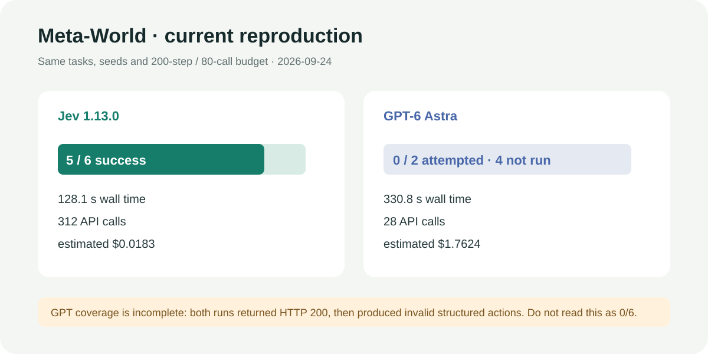
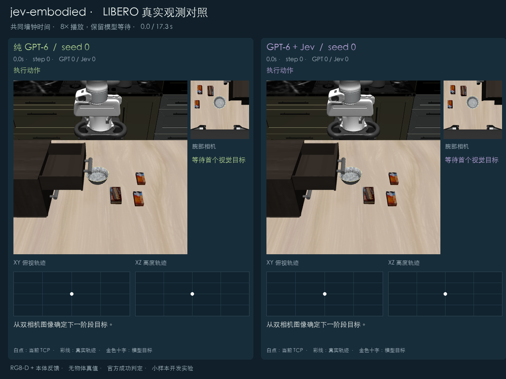

# jev-embodied

一个在本机运行的具身智能评测平台。核心问题只有一个：**引入 Jev 后，机器人任务是否更容易成功，同时更快、更便宜？**

本仓库已接通 MuJoCo Panda、Meta-World 和 LIBERO。这里只展示实际运行过的实验；失败、超时和未完成覆盖均原样保留。

## 当前结论

Jev 在“选择高层技能或结构化子目标”时表现最好：Panda 为 9/9，Meta-World 为 5/6，且调用成本明显低于当前 GPT-6 Astra 中转链路。但现有证据仍不足以证明 Jev 对所有具身任务都有效：纯 GPT 对照覆盖不完整，LIBERO 两组又在共享的 GPT 视觉规划阶段提前失败，尚未真正进入 Jev 控制。

| 环境 | Jev 路线 | 纯大模型路线 | 时间与费用重点 | 有效对照 |
|---|---|---|---|---|
| Panda | 9/9，63.98 s，$0.0049 | 0/1 冒烟，214.12 s，$0.2169 | GPT 单局约为 Jev 九局费用的 44.7 倍 | 部分：样本数不同 |
| Meta-World | 5/6，128.13 s，$0.0183 | 0/2 尝试，330.75 s，$1.7624 | GPT 两次均因动作结构错误中断 | 部分：GPT 仅覆盖 2/6 |
| LIBERO 抽屉 | GPT 视觉 + Jev，0/1，$0.0981 | 纯 GPT，0/1，$0.0972 | 两组均在第一步前失败 | 否：Jev 调用数为 0 |

[查看完整协议、失败原因和逐项结论](docs/results/reproduction-2026-09-24/RESULTS.md)



## 实验展示

### 1. Panda：验证 Jev 的接入位置

Panda 是项目自带的 MuJoCo 场景，包含搬运、堆叠和越障搬运。Jev 选择高层技能时 9/9 成功；让 Jev 直接逐步控制 XYZ 时，首局 50 次调用仍未抓起物体。因此当前推荐架构是：**Jev 做离散高层决策，代码控制器负责连续运动。**


[观看 MP4](docs/media/jev-hierarchical.mp4) · [Panda + Jev 逐局结果](docs/results/PANDA_JEV_2026-09-24.md) · [Panda + GPT 冒烟记录](docs/results/PANDA_GPT6_ASTRA_2026-09-24.md)

> 上方回放用于展示 Jev 层级控制器的真实决策与轨迹，来源是 2026-09-20 保存的 Jev episode；表格数字来自 2026-09-24 复验，两者不混算。

### 2. Meta-World：同任务、同预算的模型控制

本轮固定 3 个任务 × 2 个种子，两组使用相同初始状态、200 步、80 次调用和 `action-repeat=5`。Jev 完成 5/6；GPT-6 Astra 两个种子都在 HTTP 200 后产生无效结构化动作，因此只记录为 0/2 尝试并停止扩展，不能写成 0/6。

### 3. LIBERO：纯 GPT 与 GPT + Jev

两组使用相同抽屉任务、初始状态和双相机 RGB-D。设计上，两组共享 GPT 视觉规划器，之后分别由 GPT 或 Jev 做局部控制。本轮两次视觉目标都越出允许工作区，安全层在机器人执行前终止；混合组没有发生 Jev 调用，所以这次不能说明 Jev 有效或无效。



[观看本轮 4.2 秒配对视频](docs/results/reproduction-2026-09-24/libero/drawer-failed-pair/comparison.mp4)

## 安装与启动

主平台使用 Python 3.12；Meta-World 和 LIBERO 分别放在独立 Python 3.11 环境中，避免依赖冲突。

```bash
git clone https://github.com/zyh3699/jev-embodied.git
cd jev-embodied

conda create -n jev-embodied python=3.12 -y
conda activate jev-embodied
python -m pip install -e '.[video,plots]'

npm ci
npm run build
jev-embodied serve --port 8090
```

浏览器打开 <http://127.0.0.1:8090>，在“模型连接”中保存 Jev 与 GPT-6 Astra 配置。API Key 仅从本机凭据存储读取，不写入实验结果。

## 复现

### Panda / Jev

```bash
conda activate jev-embodied
jev-embodied evaluate \
  --manifest benchmarks/builtin-dev.json \
  --output runs/panda-jev \
  --policy jev --connection-source saved \
  --control-mode skills --observation-mode privileged \
  --max-steps 30 --max-calls 60 --timeout 180 --threshold 0
```

### Meta-World / Jev 或 GPT

```bash
conda create -n jev-metaworld python=3.11 -y
conda run -n jev-metaworld python -m pip install -r benchmarks/requirements-metaworld.txt

# 纯 GPT 时把 --policy jev 改为 --policy chat，并更换输出目录
conda activate jev-embodied
jev-embodied evaluate \
  --manifest benchmarks/metaworld-hierarchical-compare.json \
  --output runs/metaworld-jev \
  --worker-python "$(conda run -n jev-metaworld which python)" \
  --policy jev --connection-source saved \
  --control-mode hierarchical --observation-mode privileged \
  --max-steps 200 --max-calls 80 --timeout 600 \
  --threshold 0 --action-scale 0.5 --action-repeat 5
```

### LIBERO / 纯 GPT 与 GPT + Jev

```bash
conda create -n jev-libero python=3.11 -y
conda run -n jev-libero python -m pip install -r benchmarks/requirements-libero.txt
conda activate jev-embodied
python scripts/setup_libero.py --root .sim/LIBERO

jev-embodied libero-compare \
  --architecture waypoint-v1 --budget-mode wall-time \
  --manifest benchmarks/libero-drawer-compare.json \
  --worker-python "$(conda run -n jev-libero which python)" \
  --libero-root .sim/LIBERO \
  --output runs/libero-drawer-paired \
  --modes gpt6 gpt6-jev \
  --timeout 1200 --max-usd 5
```

输出目录必须不存在；复跑时请换一个新目录。LIBERO 下载固定 revision 并校验文件。

## 指标口径

- 成功：只采用各仿真环境的物理成功判定，不使用模型自评。
- 时间：端到端墙钟时间，包含模型等待。
- 费用：按报告 token 和项目配置单价估算，最终以服务商账单为准。
- 覆盖：已运行局数 / 计划局数；不把未运行用例计为失败。
- 媒体：由已保存轨迹或相机帧离线生成，导出过程不再调用模型。

## 开发验证

```bash
conda activate jev-embodied
python -m pytest -q
npm run test:ui
```

项目采用 [MIT License](LICENSE)。实现说明见 [技术指南](docs/TECHNICAL_GUIDE.md)。
