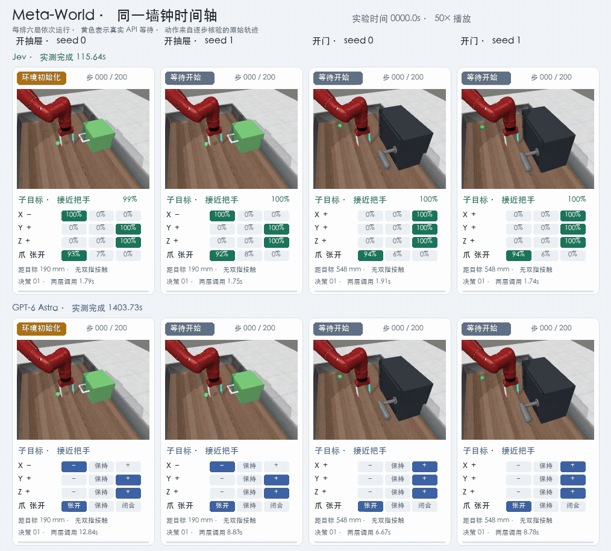
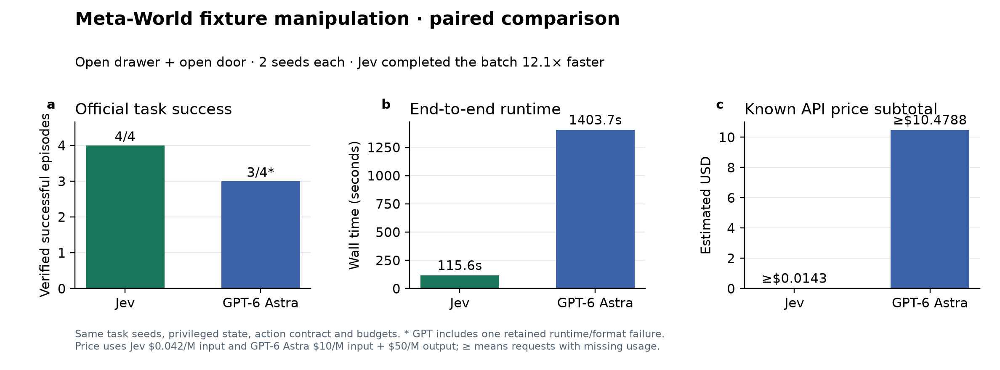

# jev-embodied

`jev-embodied` 是一个本地具身智能实验平台，用统一任务、初始状态和成功判定，对比 Jev、纯 GPT-6 Astra，以及 GPT-6 Astra + Jev 的决策效果、端到端时间和估算费用。项目支持 MuJoCo Panda、Meta-World 和 LIBERO，实验失败、超时与接口错误都会进入结果记录。

本项目评测的是“结构化候选动作 + 模型决策 + 确定性控制器”的路线，不是端到端 VLA：环境或视觉规划器生成候选项，Jev 或 GPT 负责选择，控制器把选择转换成连续机器人动作，最终成功与否只采用仿真环境的物理判定。

## 系统架构

```text
仿真环境 / 相机
       ↓
结构化状态或视觉规划器
       ↓
候选子目标、技能或控制参数
       ↓
Jev / GPT-6 Astra
       ↓
确定性控制器
       ↓
Panda、Meta-World 或 LIBERO 环境
```

| 环境 | 模型接收的内容 | 模型输出 | 连续动作执行者 |
|---|---|---|---|
| Panda | 任务目标、当前状态、可用技能 | 下一项技能 | MuJoCo 技能控制器 |
| Meta-World | 阶段状态、目标关系、候选子目标 | 子目标或技能 | 分层控制器 |
| LIBERO | 双相机视觉规划结果、候选动作与速度档位 | 候选动作及参数 | 代码伺服器 |

## 实验结果


| 环境与配对范围 | Jev 路线 | GPT 路线 | 对比结果 |
|---|---:|---:|---|
| Panda `transfer`，seed 0 | 1/1；7.39 s；$0.000538 | 1/1；47.55 s；$0.5941 | 成功相同；Jev 快 6.4×，估算费用低约 1104× |
| Meta-World 3 任务 × 2 seeds | 5/6；126.36 s；$0.0183 | 5/6；1075.66 s；$15.9184 | 成功相同；Jev 快 8.5×，估算费用低约 872× |
| Meta-World 抽屉/门 × 2 seeds | 4/4；115.64 s；≥$0.0143 | 3/4；1403.73 s；≥$10.4788 | Jev 快 12.1×；GPT 一局因接口超时后的格式错误中断 |
| LIBERO 关闭抽屉，init 0 | GPT 候选 + Jev：0/1；1068.40 s；$5.0931；505 步 | 0/1；998.84 s；$5.0562；310 步 | 两组均失败；现有结果不能证明成功率提升 |

费用按 Jev 输入 `$0.042 / 1M`、GPT-6 Astra 输入/输出 `$10 / $50 / 1M` 估算，仅用于实验内统一比较，不代表 API 中转平台的实际账单。样本规模较小；结果能够说明 Jev 在结构化局部决策中的延迟和费用优势，不能据此推断所有具身任务的成功率。

[完整协议、逐局指标与失败原因](docs/results/reproduction-fixed-2026-09-24/RESULTS.md) · [总览原始数据](docs/results/reproduction-fixed-2026-09-24/final-overview-v2/metrics.json)

### Panda：高层技能选择

Jev 与 GPT 使用同一个 MuJoCo 场景和 seed。模型从离散技能中选择下一步，代码控制器执行连续运动。配对任务中两组均成功；墙钟动图保留 API 等待时间，因此可直接观察 7.39 秒与 47.55 秒的端到端差异。


[墙钟对照 MP4](docs/results/reproduction-fixed-2026-09-24/panda/wallclock-comparison.mp4) · [Jev 轨迹](docs/results/reproduction-fixed-2026-09-24/panda/jev-transfer.mp4) · [GPT 轨迹](docs/results/reproduction-fixed-2026-09-24/panda/gpt-transfer.mp4)

### Meta-World：分层子目标选择

`reach-v3`、`push-v3` 和 `pick-place-v3` 各运行两个相同 seeds，共享 200 步和 80 次模型调用上限。两种路线都在 `push-v3` seed 0 达到步数上限，其余五局成功。保存动作的回放与原记录逐步核对，观测和成功标记误差均为 0。


[墙钟对照 MP4](docs/results/reproduction-fixed-2026-09-24/metaworld/paired-wallclock.mp4) · [逐步回放 MP4](docs/results/reproduction-fixed-2026-09-24/metaworld/paired-grid.mp4) · [统计图](docs/results/reproduction-fixed-2026-09-24/metaworld/comparison/comparison.png) · [逐局 CSV](docs/results/reproduction-fixed-2026-09-24/metaworld/comparison/episodes.csv)

`drawer-open-v3` 和 `door-open-v3` 同样各运行两个相同 seeds。适配器提供把手接近、贴合、拉抽屉和转动门的阶段状态，成功仍由 Meta-World 官方判定。





[墙钟对照 MP4](docs/results/reproduction-fixed-2026-09-24/metaworld-fixtures/paired-wallclock.mp4) · [统计数据](docs/results/reproduction-fixed-2026-09-24/metaworld-fixtures/summary.json) · [逐局统计图](docs/results/reproduction-fixed-2026-09-24/metaworld-fixtures/comparison/comparison.png)

### LIBERO：视觉规划与局部控制

两组共享 GPT 双相机时序视觉候选生成器和同一代码伺服器，区别是由 GPT 或 Jev 选择候选动作及正常/谨慎速度。纯 GPT 在 310 步达到 `$5` 费用保护，GPT + Jev 在相近费用下执行 505 步；两组都未通过 LIBERO 官方成功判定。


[包含模型等待时间的 MP4](docs/results/reproduction-fixed-2026-09-24/libero/drawer-supervisor-v2/comparison.mp4)

## 安装与启动

主平台使用 Python 3.12。Meta-World 和 LIBERO 使用各自的 Python 3.11 环境，避免仿真依赖冲突。

```bash
git clone https://github.com/zyh3699/jev-embodied.git
cd jev-embodied

conda create -n jev-embodied python=3.12 -y
conda activate jev-embodied
python -m pip install -e '.[video,plots]'

npm ci
npm run build
jev-embodied serve --port 8090
```

浏览器打开 <http://127.0.0.1:8090>。在“模型连接”中分别保存 Jev 和 GPT-6 Astra 的接口配置，再从实验页选择任务、决策方式、观测来源、相机和预算。API Key 保存在本机凭据存储中，不会写入实验记录或仓库文件。

## 复现实验

### Panda

```bash
jev-embodied evaluate \
  --manifest benchmarks/builtin-smoke.json --output runs/panda-gpt \
  --policy chat --connection-source saved \
  --control-mode skills --observation-mode privileged \
  --max-steps 30 --max-calls 60 --timeout 600 --threshold 0 \
  --validation-retries 1 --request-retries 1 --continue-on-error
```

将 `--policy chat` 改成 `--policy jev` 即运行 Jev。三项任务、三个 seeds 的开发集使用 `benchmarks/builtin-dev.json`。

### Meta-World

```bash
python scripts/run_metaworld_hierarchical_comparison.py \
  --output runs/metaworld-paired \
  --worker-python .venv-metaworld/bin/python \
  --plot-python "$(which python)" \
  --validation-retries 1 --request-retries 1
```

抽屉和门任务使用同一命令，并添加：

```bash
--manifest benchmarks/metaworld-fixtures-compare.json
```

### LIBERO

```bash
jev-embodied libero-compare \
  --architecture supervisor-v2 --budget-mode wall-time \
  --manifest benchmarks/libero-drawer-compare.json \
  --worker-python .venv-libero/bin/python --libero-root .sim/LIBERO \
  --output runs/libero-drawer-paired --modes gpt6 gpt6-jev \
  --timeout 1200 --max-usd 5 --action-repeat 5 --action-scale 0.5 \
  --camera-size 384 --validation-retries 2 --request-retries 1 \
  --continue-on-error
```

实验输出目录必须不存在。Meta-World、LIBERO 的固定依赖版本和完整协议见[实验结果说明](docs/results/reproduction-fixed-2026-09-24/RESULTS.md)。

## 指标口径

- **成功率**：采用环境官方物理成功判定，不使用模型自评。
- **端到端时间**：包含网络请求、模型等待和机器人执行时间。
- **估算费用**：根据 API 返回的 token 数和统一单价计算；缺失用量不会按 0 处理。
- **配对原则**：同一组必须共享任务、seed、初始状态和资源限制。
- **实验媒体**：只由本仓库运行时保存的 qpos、动作或相机帧生成，导出过程不调用模型。

## 仓库结构

```text
frontend/       实验配置与运行界面
src/            Python 服务、适配器、策略和评测逻辑
benchmarks/     Panda、Meta-World 与 LIBERO 实验清单
scripts/        仿真运行、回放、绘图和结果校验脚本
tests/          Python 单元与集成测试
tests-ui/       Playwright 前端测试
docs/results/   实验协议、结构化指标、图片与视频
```

## 验证

```bash
python -m pytest -q
npm run build
npm run test:ui
```

项目采用 [MIT License](LICENSE)。代码架构和扩展方式见[技术指南](docs/TECHNICAL_GUIDE.md)。
