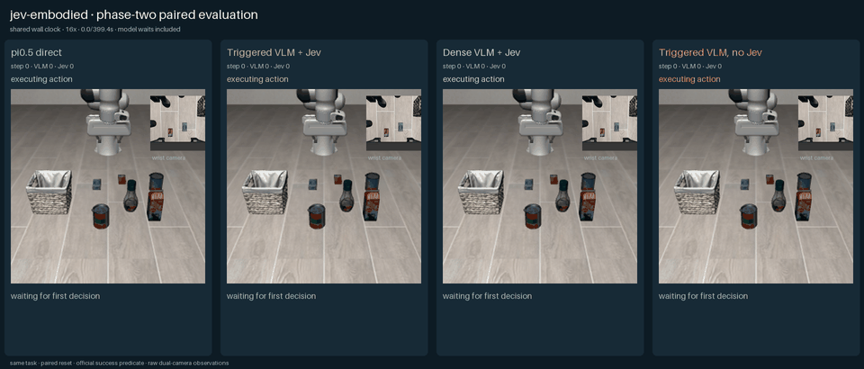
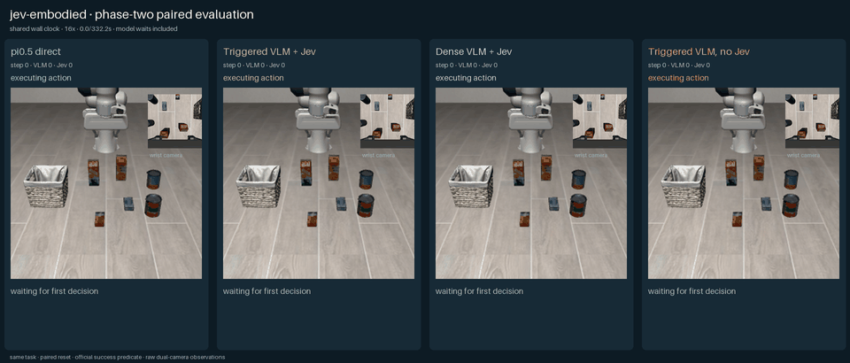
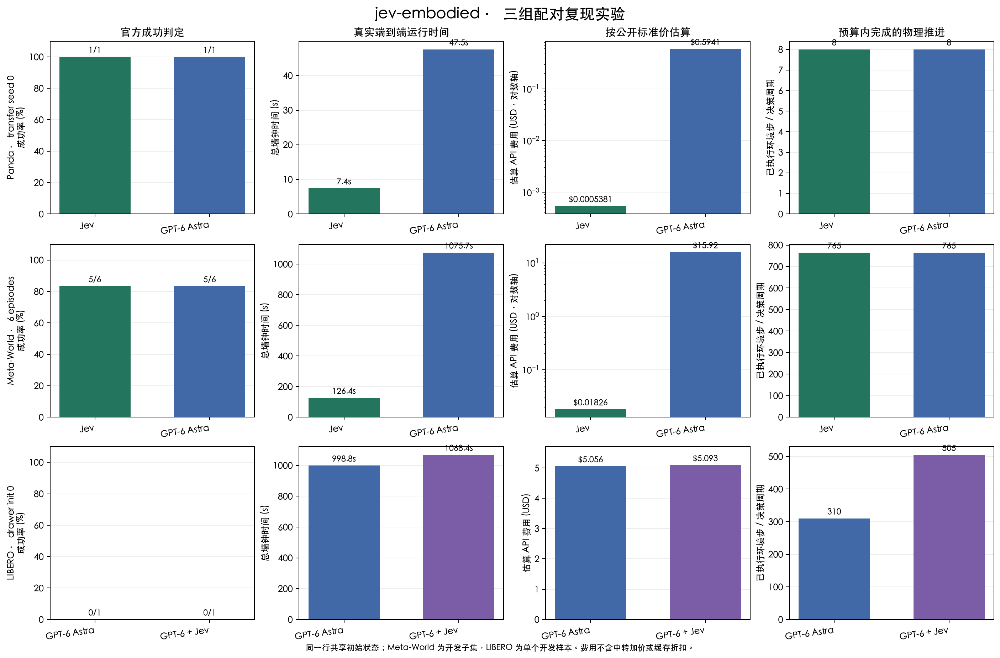
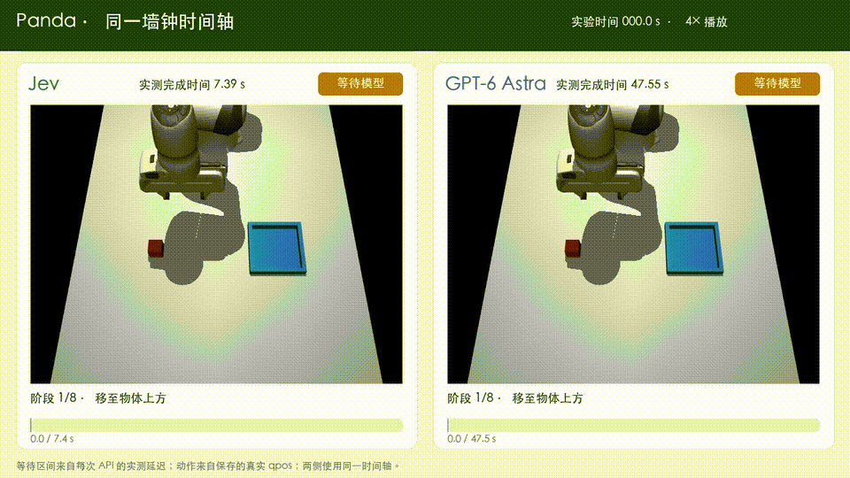
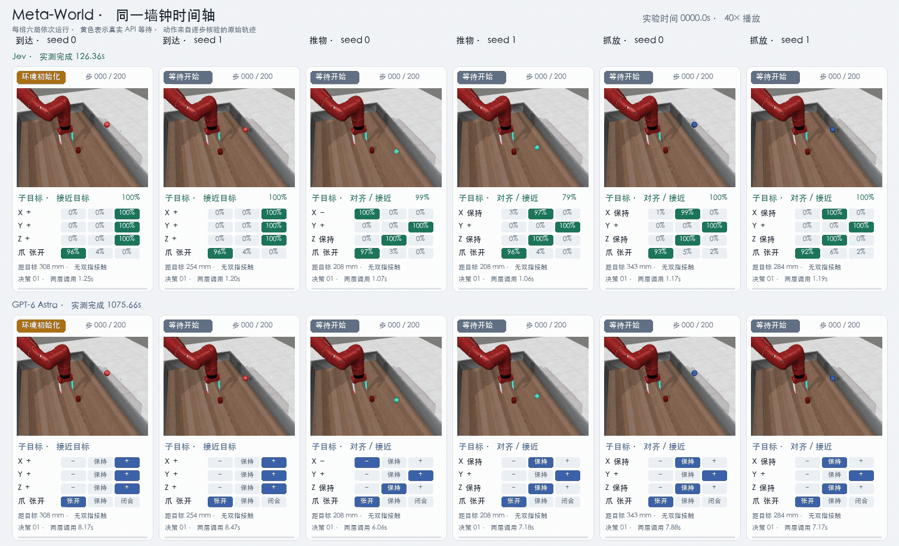
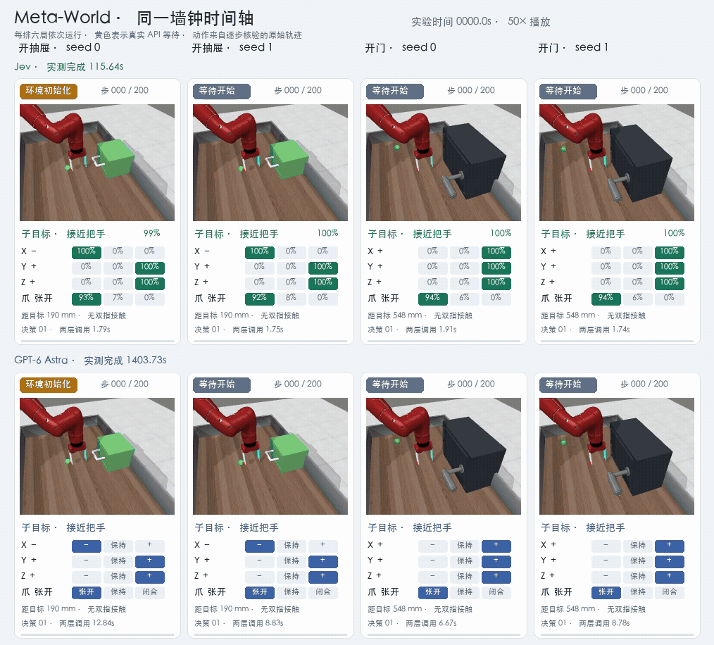
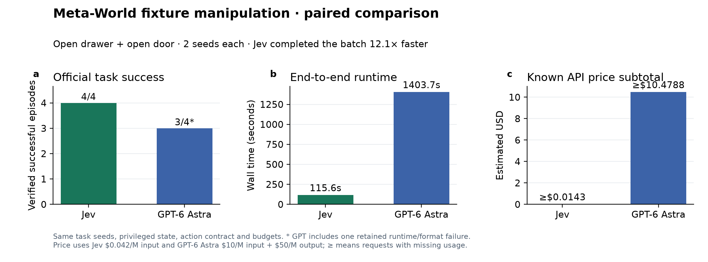
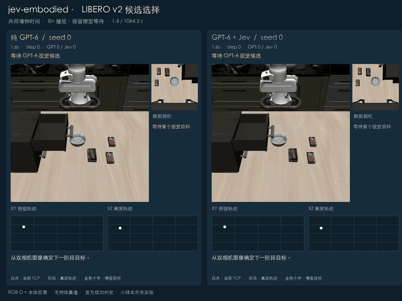

# jev-embodied

`jev-embodied` 是一个本地具身智能实验平台，用统一任务、初始状态和成功判定，对比 Jev、纯 GPT-6 Astra，以及 GPT-6 Astra + Jev 的决策效果、端到端时间和估算费用。项目支持 MuJoCo Panda、Meta-World 和 LIBERO，实验失败、超时与接口错误都会进入结果记录。

二阶段新增独立的 LIBERO 四路线配对实验：`π0.5` 直接输出连续动作块，不调用 Jev；`Qwen3.5 + Jev` 分为按需规划和逐轮规划；第四条无 Jev 路线固定采用 Qwen 语义关键帧对应的名义动作块。当前混合控制器不含任务命名宏技能：本地 Qwen3.5-27B 提供语义像素/关键帧，任务无关的 RGB-D 几何层产生数值 `H×7` 候选动作块，Jev 选择要执行的精确数组。二阶段不调用远端 GPT，Jev 可暂时使用远端接口。四条路线共享任务、初始状态、相机、步数上限和 LIBERO 官方成功判定。

一期评测的是“结构化候选动作 + 模型决策 + 确定性控制器”路线；二阶段才把它与端到端 VLA 正面对比。结构化路线由环境或视觉模型生成证据与候选项，Jev 负责选择；π0.5 路线则直接生成连续动作。所有路线最终成功与否都只采用仿真环境的物理判定。

## 系统架构

```text
仿真环境 / 相机
       ↓
结构化状态或视觉关键帧规划器
       ↓
候选子目标、技能或数值动作块
       ↓
Jev / GPT-6 Astra
       ↓
确定性控制器
       ↓
Panda、Meta-World 或 LIBERO 环境
```

| 环境 | 模型接收的内容 | 模型输出 | 连续动作执行者 |
|---|---|---|---|
| Panda | 任务目标、当前状态、可用技能 | 下一项技能 | MuJoCo 技能控制器 |
| Meta-World | 阶段状态、目标关系、候选子目标 | 子目标或技能 | 分层控制器 |
| LIBERO | 双相机 RGB、任务、本体反馈与通用数值候选块 | 精确 `H×7` 动作块 | 滚动连续动作执行器 |

## 实验结果

### 二阶段：π0.5 vs Qwen3.5 + Jev

2026-10-06 在双卡 H20 上完成了 2 个 LIBERO-90 固定开发初态的四路线配对实验，共 8/8 局通过官方成功判定：`π0.5`、无 Jev、按需 `Qwen3.5 + Jev` 和逐轮 `Qwen3.5 + Jev` 均为 2/2。π0.5 平均 129.5 步、34.36 秒；无 Jev 为 370.5 步、85.51 秒；按需 Jev 为 485.5 步、154.43 秒；逐轮 Jev 为 483.0 步、372.37 秒。

修正版仍让四条路线通过连续 `H×7` 接口执行，但为混合路线补齐了 RGB-D 反投影、分层 XYZ 接触/运输/释放和显式阶段锁定。Qwen 只提出语义关键帧；公开静态资产纹理只做外观匹配，不提供场景真值位姿、分割或成功标签。Jev 确实在多个动作块之间裁决，但本轮常偏向谨慎动作，所以不能声称它比无 Jev 或 π0.5 更快。样本仅有两个固定初态，这是系统级开发验证，不是 LIBERO 榜单或泛化结论。

Alphabet soup 放入篮子：



Cream cheese 放入篮子：



[完整二阶段结果、限制与视频](docs/results/phase2-reference-grounded-2026-10-06/RESULTS.md) · [机器可读指标](docs/results/phase2-reference-grounded-2026-10-06/metrics.json) · [实验协议](docs/results/phase2-reference-grounded-2026-10-06/protocol.json) · [上一版失败消融](docs/results/phase2-action-chunks-2026-10-05/RESULTS.md)

### 一阶段：Jev vs GPT-6 Astra



| 环境与配对范围 | Jev 路线 | GPT 路线 | 对比结果 |
|---|---:|---:|---|
| Panda `transfer`，seed 0 | 1/1；7.39 s；$0.000538 | 1/1；47.55 s；$0.5941 | 成功相同；Jev 快 6.4×，估算费用低约 1104× |
| Meta-World 3 任务 × 2 seeds | 5/6；126.36 s；$0.0183 | 5/6；1075.66 s；$15.9184 | 成功相同；Jev 快 8.5×，估算费用低约 872× |
| Meta-World 抽屉/门 × 2 seeds | 4/4；115.64 s；≥$0.0143 | 3/4；1403.73 s；≥$10.4788 | Jev 快 12.1×；GPT 一局因接口超时后的格式错误中断 |
| LIBERO 关闭抽屉，init 0 | GPT 候选 + Jev：0/1；1068.40 s；$5.0931；505 步 | 0/1；998.84 s；$5.0562；310 步 | 两组均失败；现有结果不能证明成功率提升 |

费用按 Jev 输入 `$0.042 / 1M`、GPT-6 Astra 输入/输出 `$10 / $50 / 1M` 估算，仅用于实验内统一比较，不代表 API 中转平台的实际账单。样本规模较小；结果能够说明 Jev 在结构化局部决策中的延迟和费用优势，不能据此推断所有具身任务的成功率。

[完整协议、逐局指标与失败原因](docs/results/reproduction-fixed-2026-09-24/RESULTS.md) · [总览原始数据](docs/results/reproduction-fixed-2026-09-24/final-overview-v2/metrics.json)

### Panda：高层技能选择

Jev 与 GPT 使用同一个 MuJoCo 场景和 seed。模型从离散技能中选择下一步，代码控制器执行连续运动。配对任务中两组均成功；墙钟动图保留 API 等待时间，因此可直接观察 7.39 秒与 47.55 秒的端到端差异。



[墙钟对照 MP4](docs/results/reproduction-fixed-2026-09-24/panda/wallclock-comparison.mp4) · [Jev 轨迹](docs/results/reproduction-fixed-2026-09-24/panda/jev-transfer.mp4) · [GPT 轨迹](docs/results/reproduction-fixed-2026-09-24/panda/gpt-transfer.mp4)

### Meta-World：分层子目标选择

`reach-v3`、`push-v3` 和 `pick-place-v3` 各运行两个相同 seeds，共享 200 步和 80 次模型调用上限。两种路线都在 `push-v3` seed 0 达到步数上限，其余五局成功。保存动作的回放与原记录逐步核对，观测和成功标记误差均为 0。



[墙钟对照 MP4](docs/results/reproduction-fixed-2026-09-24/metaworld/paired-wallclock.mp4) · [逐步回放 MP4](docs/results/reproduction-fixed-2026-09-24/metaworld/paired-grid.mp4) · [统计图](docs/results/reproduction-fixed-2026-09-24/metaworld/comparison/comparison.png) · [逐局 CSV](docs/results/reproduction-fixed-2026-09-24/metaworld/comparison/episodes.csv)

`drawer-open-v3` 和 `door-open-v3` 同样各运行两个相同 seeds。适配器提供把手接近、贴合、拉抽屉和转动门的阶段状态，成功仍由 Meta-World 官方判定。





[墙钟对照 MP4](docs/results/reproduction-fixed-2026-09-24/metaworld-fixtures/paired-wallclock.mp4) · [统计数据](docs/results/reproduction-fixed-2026-09-24/metaworld-fixtures/summary.json) · [逐局统计图](docs/results/reproduction-fixed-2026-09-24/metaworld-fixtures/comparison/comparison.png)

### LIBERO：视觉规划与局部控制

两组共享 GPT 双相机时序视觉候选生成器和同一代码伺服器，区别是由 GPT 或 Jev 选择候选动作及正常/谨慎速度。纯 GPT 在 310 步达到 `$5` 费用保护，GPT + Jev 在相近费用下执行 505 步；两组都未通过 LIBERO 官方成功判定。



[包含模型等待时间的 MP4](docs/results/reproduction-fixed-2026-09-24/libero/drawer-supervisor-v2/comparison.mp4)

## 安装与启动

主平台使用 Python 3.12。Meta-World 和 LIBERO 使用各自的 Python 3.11 环境，避免仿真依赖冲突。

```bash
git clone https://github.com/zyh3699/jev-embodied.git
cd jev-embodied

conda create -n jev-embodied python=3.12 -y
conda activate jev-embodied
python -m pip install -e '.[video,plots]'

npm ci
npm run build
jev-embodied serve --port 8090
```

浏览器打开 <http://127.0.0.1:8090>。在“模型连接”中分别保存 Jev 和 GPT-6 Astra 的接口配置，再从实验页选择任务、决策方式、观测来源、相机和预算。API Key 保存在本机凭据存储中，不会写入实验记录或仓库文件。

## 复现实验

### Panda

```bash
jev-embodied evaluate \
  --manifest benchmarks/builtin-smoke.json --output runs/panda-gpt \
  --policy chat --connection-source saved \
  --control-mode skills --observation-mode privileged \
  --max-steps 30 --max-calls 60 --timeout 600 --threshold 0 \
  --validation-retries 1 --request-retries 1 --continue-on-error
```

将 `--policy chat` 改成 `--policy jev` 即运行 Jev。三项任务、三个 seeds 的开发集使用 `benchmarks/builtin-dev.json`。

### Meta-World

```bash
python scripts/run_metaworld_hierarchical_comparison.py \
  --output runs/metaworld-paired \
  --worker-python .venv-metaworld/bin/python \
  --plot-python "$(which python)" \
  --validation-retries 1 --request-retries 1
```

抽屉和门任务使用同一命令，并添加：

```bash
--manifest benchmarks/metaworld-fixtures-compare.json
```

### LIBERO

```bash
jev-embodied libero-compare \
  --architecture supervisor-v2 --budget-mode wall-time \
  --manifest benchmarks/libero-drawer-compare.json \
  --worker-python .venv-libero/bin/python --libero-root .sim/LIBERO \
  --output runs/libero-drawer-paired --modes gpt6 gpt6-jev \
  --timeout 1200 --max-usd 5 --action-repeat 5 --action-scale 0.5 \
  --camera-size 384 --validation-retries 2 --request-retries 1 \
  --continue-on-error
```

实验输出目录必须不存在。Meta-World、LIBERO 的固定依赖版本和完整协议见[实验结果说明](docs/results/reproduction-fixed-2026-09-24/RESULTS.md)。

### 二阶段：π0.5 vs Qwen3.5 + Jev

服务器部署和运行步骤见 [二阶段双 H20 实验手册](docs/PHASE2_SERVER.md)，本轮正式结果见 [2026-10-06 参考外观 grounding 实验报告](docs/results/phase2-reference-grounded-2026-10-06/RESULTS.md)。快速入口：

```bash
jev-embodied phase2-compare \
  --manifest benchmarks/libero-phase2-supported-smoke.json \
  --output runs/phase2-smoke \
  --worker-python .venv-libero/bin/python \
  --modes pi05 vlm-jev-triggered vlm-jev-dense vlm-chunk-no-jev \
  --pi05-host 127.0.0.1 --pi05-port 8000 \
  --vlm-base-url http://127.0.0.1:8001/v1 \
  --vlm-model Qwen/Qwen3.5-27B --vlm-revision REVISION_SHA \
  --continue-on-error
```

四条路线最终都通过同一个连续 `H×7` 动作接口控制 LIBERO。混合路线不含任务命名宏技能：Qwen3.5-VL 产生语义像素/关键帧，已知相机标定和 RGB-D 几何层构造分层数值动作块，Jev 负责局部裁决；`vlm-chunk-no-jev` 固定选择名义动作块，用于隔离 Jev 的真实贡献。主进程只负责模型调用与记录，LIBERO 仍在隔离的 worker 环境中运行。正式实验前先跑 smoke 清单，确认所有链路和配对初始状态完全一致。

## 指标口径

- **成功率**：采用环境官方物理成功判定，不使用模型自评。
- **端到端时间**：包含网络请求、模型等待和机器人执行时间。
- **估算费用**：根据 API 返回的 token 数和统一单价计算；缺失用量不会按 0 处理。
- **配对原则**：同一组必须共享任务、seed、初始状态和资源限制。
- **实验媒体**：只由本仓库运行时保存的 qpos、动作或相机帧生成，导出过程不调用模型。

## 仓库结构

```text
frontend/       实验配置与运行界面
src/            Python 服务、适配器、策略和评测逻辑
benchmarks/     Panda、Meta-World 与 LIBERO 实验清单
scripts/        仿真运行、回放、绘图和结果校验脚本
docs/results/   实验协议、结构化指标、图片与视频
```

## 验证

```bash
npm run build
python -m embodied_jev.cli --help
```

项目采用 [MIT License](LICENSE)。
