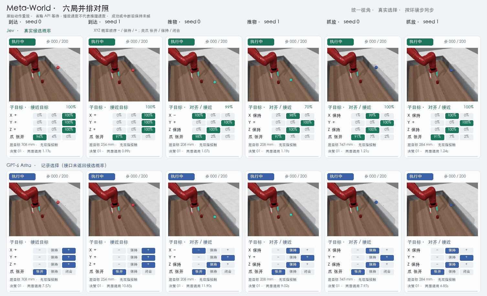

# Meta-World 实测结果

日期：2026-09-21。任务为 reach、push、pick-place，各使用 seed 0、1。环境为 Meta-World 3.1.1 / MuJoCo 3.3.0；每局最多 200 步、40 个规划周期、80 次请求、600 秒。

## 层级 v2 结论

**Jev 5/6，GPT-6 Astra 5/6。** 两者都完成 reach 两局、push seed 1、pick-place 两局；共同失败点是 `push-v3-0` 步数耗尽。

| 指标 | Jev | GPT-6 Astra |
| --- | ---: | ---: |
| 成功 / 计划 | **5/6** | **5/6** |
| 到达 / 推物 / 抓放 | **2/2 · 1/2 · 2/2** | **2/2 · 1/2 · 2/2** |
| 环境步数 | 765 | 765 |
| 请求数 | 312 | 312 |
| 输入 / 输出 token | 435,903 / 30,620 | 316,469 / 8,812 |
| HTTP 延迟 p50 / p95 | 0.328s / 0.611s | 4.011s / 8.126s |
| 每局耗时中位数 | 18.389s | 249.597s |
| 官方单价估算费用 | **$0.018308** | **$3.605290** |

上排 Jev、下排 GPT-6；列为到达、推物、抓放的 seed 0 / 1。动图按环境步同步，展示子目标、四通道选择与调用耗时；Jev 显示真实概率，GPT 无概率。回放省略 API 等待，不代表推理速度。[加速 MP4](results/metaworld-hierarchy-v2-2026-09-21/figures/hierarchy-grid-fast.mp4) · [完整 MP4](results/metaworld-hierarchy-v2-2026-09-21/figures/hierarchy-grid.mp4)

## 和直接控制相比

| 方案 | Jev | GPT-6 Astra |
| --- | ---: | ---: |
| 直接四通道 | 2/6 | 5/6 |
| 层级 v2 | **5/6** | **5/6** |

层级 v2 同时改变了状态表达、子目标提示和控制阶段，所以不能称为纯“子目标层”单因素消融。直接控制预算也不同，只作为历史参考。

## 失败重点

- `push-v3-0` 是两模型共同失败局。物体被推动过，但后段接触保持和重新对齐失败，最终没有进入官方成功阈值。
- 补测前 GPT-6 曾出现 HTTP `ReadTimeout`。同一冻结 runtime、同一 saved connection、同一任务种子后来完成成功，说明那是通信链路/上游响应超时，不是输入格式错误；主结果只采用最新完整六局。

## 费用口径

Jev 按 TypeSafe 公开模型价 `$0.042/M input token`、输出免费估算；GPT-6 Astra 按 OpenAI 公开价 `$10/M input token`、`$50/M output token` 估算。GPT 缓存命中未在日志中拆分，因此按未缓存标准价。详见 [费用明细](results/metaworld-hierarchy-v2-2026-09-21/COSTS.md)。

抓放的官方成功判定是物体到目标不超过 7 cm，不要求松手和撤离；本结果不代表完整精确放置流程。确定性参考控制 5/6 仅用于验证物理链路，不计入模型成绩。

[图表与逐局数据](results/metaworld-hierarchy-v2-2026-09-21/) · [逐局 CSV](results/metaworld-hierarchy-v2-2026-09-21/episodes.csv) · [逐请求 CSV](results/metaworld-hierarchy-v2-2026-09-21/api_calls.csv)
