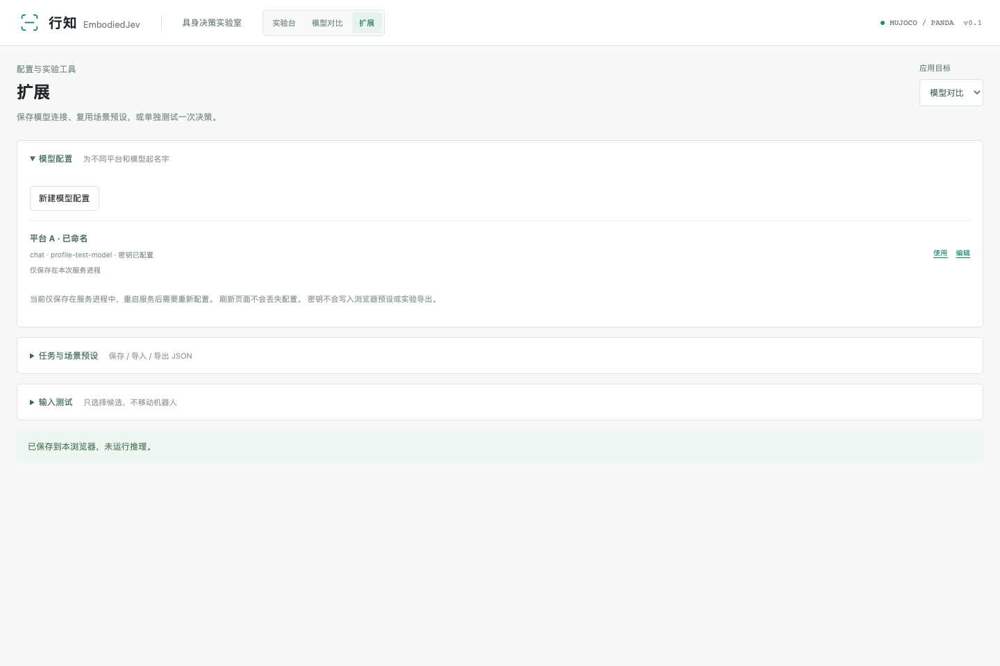

# 扩展与二次开发

顶部 **扩展** 提供模型配置、场景预设和独立输入测试。已有任务可直接调整参数；新增机器人或任务逻辑，需要修改代码。



## 保存多套模型接口

为每套连接起名，填写接口类型、地址、模型 ID 和 Key，保存为模型配置。单实验和模型对比都能选择它们。同一种 OpenAI 兼容协议可以保存多个平台、不同模型和各自的 Key，不必来回覆盖同一条连接。

支持 TypeSafe Jev、OpenAI 兼容聊天、Claude 原生 Messages 和结构化决策服务。模型 ID 以服务商实际开放的名称为准，保存后可用输入测试验证调用。原有“模型连接”入口仍可使用。

通过 `embodied-jev serve` 启动时，Key 保存在系统钥匙串，连接信息保存在仓库外，重启后可恢复。系统存储不可用时，页面显示“仅本次会话”，不会改存明文 Key。存储位置和仅内存模式见 [技术说明](TECHNICAL_GUIDE.md#models)。

Key 不回填到密码框，也不进入预设或实验导出。更换接口地址后，需重新填写 Key；实验输入会检查误粘的凭据。鉴权信息只用于请求你配置的服务商。

## 创建场景预设

选择搬运入盘、方块堆叠或越障搬运作为物理模板，为新预设起名，修改物体起点、目标位置和障碍高度。应用预设会重新建立真实仿真，不会自动调用模型。

- `source_xy`：方块起点，单位米；显式填写时固定位置。留空使用原来的种子随机扰动。
- `target_xy`：目标位置；托盘或支撑块及其围边一起移动。
- `barrier_height`：仅用于越障模板，范围 0.02–0.16 米；其他模板不使用此字段。
- `user_context`：额外 JSON 上下文，供模型参考，不替换传感器反馈或物理成功条件。物体与目标信息由所选观察模式提供；直接视觉实验不要在这里额外填写真值坐标。

例如 [transfer-preset.json](../examples/transfer-preset.json)：

```json
{
  "format": "embodied-jev-preset-v1",
  "name": "搬运练习 · 固定起点",
  "task": "transfer",
  "scene_config": {
    "name": "搬运练习 · 固定起点",
    "source_xy": [0.42, -0.17],
    "target_xy": [0.44, 0.18]
  },
  "user_context": {
    "experiment_note": "Compare choices at a fixed object and destination position."
  }
}
```

预设保存在当前浏览器，可导出 JSON 到其他浏览器使用。应用时会检查字段、范围、初始物体间距与关键位置可达性，任务是否完成则由运行后的物理状态判断。

同一预设也能用于命令行：

```bash
embodied-jev benchmark --preset examples/transfer-preset.json \
  --seeds 0 --provider baseline --output runs/custom-scene.json
```

改用模型 provider 时，需按普通 CLI 评测设置环境变量；`benchmark` 不读取网页服务保存的钥匙串连接。

当前预设编辑器基于三类已有任务，支持位置、障碍高度和补充输入。开门、插接或更换机器人，需要补充相应对象、动作与成功条件；它还不是任意机器人或自由 3D 场景编辑器。规则基线不会读取自然语言要求来改变策略。

## 单独测试输入与候选

在 **输入测试** 中选择模型，填写 JSON 状态、决策问题和候选，点击测试即可查看选择、概率来源和耗时。这个入口不执行机械臂动作。

例如候选 JSON：

```json
{
  "approach": "Move above the object before descending.",
  "grasp": "Close the gripper at the object's current position.",
  "hold": "Keep the current pose."
}
```

可用它检查接口格式，或比较语言、候选顺序、状态变化对选择的影响。这里的选项是测试数据，尚未连接到动作执行器。规则基线只返回固定候选，适合检查页面流程。

API 测试会发送输入并可能产生费用。Key 请填写在模型配置的密码栏。

## 代码扩展位置

| 想增加什么 | 从哪里开始 | 需要接好的部分 |
| --- | --- | --- |
| 同协议的新模型 | 页面具名模型配置 | 地址、模型 ID、鉴权、真实调用验证 |
| 不同协议的模型 | `policies.py` | 请求、候选校验、返回格式、耗时与用量 |
| 新场景参数 | `scenarios.py`、`physics.py` | 配置验证、XML 对象、场景哈希、回放几何 |
| 新任务类型 | `physics.py`、`planning.py`、`incremental.py` | 对象、接触与成功条件；技能模式的阶段和目标；逐步模式的任务说明 |
| 新候选动作 | `planning.py` 或 `incremental.py`，以及 `runtime.py` | 技能目标或固定短步、夹爪指令、安全检查、执行与中文显示 |
| 新观察输入 | `perception.py`、`runtime.py`、`evidence.py`、`incremental.py` | 图像/状态适配、标定、跟踪与来源；直接图像不得混入物体真值 |
| 逐步动作 | `incremental.py`、`runtime.py` | 固定 XYZ/夹爪菜单、选择后的安全检查、实际转移历史；不要混入预设阶段 |
| 新机器人 | `physics.py` 和资产目录 | 关节/执行器、IK、夹爪接触、碰撞和可达范围 |
| 新界面 | `frontend/` | 配置表单、响应式显示、真实 API、浏览器测试 |

新增任务 ID 或 provider 时，记得更新后端请求校验、前端选项与测试。JSON 预设只接受数据，不执行脚本或加载任意 MJCF。

欢迎通过 PR 分享模型适配、任务模板、场景预设或失败实验，请附上复现命令和实际结果。
