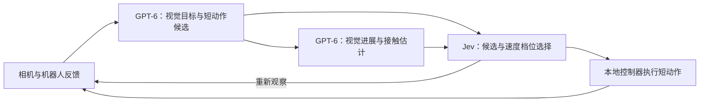

# Jev 应该接在哪一层

**新版 `supervisor-v2` 已接入：GPT-6 比较动作前后画面并提出短动作候选，Jev 选择候选与速度档位，确定性控制器执行。** 数值误差、坐标变换和运动方向计算交给代码。LIBERO 推盘子测试已暂停，尚无完整配对结果；两种模式共享观测、候选接口与执行器。

以下区分本项目实现、上游源码与作者报告；未在本地复现上游项目的成绩。

## 为什么当前接法需要调整

旧版 `waypoint-v1` 混合组中，GPT-6 从双相机画面给出航点，Jev 接收航点误差，再分别选择 XYZ、旋转与夹爪方向。它不接收图片，也没有实际接触力输入。

**正确跟踪航点不等于有效推动物体。** 接近目标、建立接触和物体推进应分别判断；尚未完成的接近动作不能仅因物体静止就被放弃。Jev 的选择层更快、更便宜，也必须通过整个系统的成功、耗时和费用验证收益。

官方明确写明：Jev 1.13 只接收文本，擅长有限、明确的判断；精确算术应放在代码里，数值 Score 不适合直接插值得到精确控制量。[输入能力](https://docs.typesafe.ai/models) · [已知限制](https://docs.typesafe.ai/model-jaggedness/jev-1.13) · [构建方法](https://docs.typesafe.ai/concepts/how-to-build-with-system-one)

## 开源项目里值得借鉴的部分

| 项目／核对版本 | 实际接法 | 对本项目的启发与边界 |
| --- | --- | --- |
| [jev-libero · 3bdad98](https://github.com/Dimweaker/jev-libero/tree/3bdad985b225aeccc39fbe5863c6eea2e81c515a) | 程序预演候选，Jev 依次选意图、接触／运动类别、原子动作；有两步预演 | 借鉴“按预期效果选动作”。**它使用仿真关节真值、接触、预测成功等信息**，不是纯相机控制；不能直接与本项目视觉组比费用／成功率 |
| [robojev · 76ebe5c](https://github.com/alee792/robojev/tree/76ebe5c964fef105e3f2e44e0c5315f1519b5e78) | WidowX 真机实验；Jev 选目标、放置关系、动作基元；事件触发调用，丢弃过期响应 | 对 Piper 最有借鉴价值的是执行循环与推理分离。作者坦承对一个纸杯和桌面高度拟合；场景相机、VLM 命名层等未在真机闭环验证 |
| [UR5e + Jev · ffffb2e](https://github.com/JoeSun-421/robotic_agent_use_jev/tree/ffffb2e27edd4717970e5c03fbbbb2a90a979a33) | Qwen 视觉分类，Jev 选目标、双臂调度、运动类别和恢复策略；代码执行 IK | 借鉴双臂分工和技能选择。但执行端仍绑定仿真物体／箱体坐标，不等于全链路只靠真实视觉；公开演示仍待补齐 |
| [OpenRoboto · 7a4ed8b](https://github.com/openroboto-ai/jev-robot-control/tree/7a4ed8b72c3c17d7aa790678ed9660df67c10dd3) | 意图 → XYZ／夹爪选择；结构化几何和接触输入 | 与现有 Meta-World 分层接法接近；公开对比每模型仅一局、非相机感知，不能据此证明通用机器人能力 |
| [Jev-as-Policy · cac97e7](https://github.com/YuanKJing/Jev-as-Policy/tree/cac97e79845bf56a5b2ef0e6d4928238bf5caee7) | 意图 → XYZ／夹爪选择；连续 Cartesian servo；API 等待期间继续执行；抓取／下放阶段降速；新观测重新计算目标 | 结构最接近当前控制器，但仓库明确是 **MuJoCo 仿真、无硬件驱动**；几何、接触和抓取状态来自仿真真值，不能当相机 VLA 结果 |
| [RoboJEV · 30f0aae](https://github.com/lykycy123/RoboJEV/tree/30f0aae82db1d96e4977a95321990238597c83e0) | 结构化状态与分层选择；独立规则基线、多种子 | 借鉴评价方法。新挑战集跨障碍抓放为 Jev 5/10、规则 8/10，提醒我们必须实测 Jev 相比规则是否有额外收益 |
| [jev-realtime-sdk · 61ad2bf](https://github.com/chy4pro/jev-realtime-sdk/tree/61ad2bf5f37e0159185d9430b3d127a70b507fc8) | 代码执行快循环，Jev 执行慢决策循环；动作有效期、过期响应处理 | 借鉴软件接口。该版本只验证模拟执行器，尚无真实执行器部署，不能当作真机成熟度证据 |
| [Piper Astra + Jev · 10d671e](https://github.com/RobotKitAI/piper-astra-jev/tree/10d671e01d467475084033e7af9f6595886ab7b3) | 真实 AgileX Piper；Astra 直接看图；Jev 配合 Grounding DINO／SAM3；夹爪状态确认后才允许抬升；深度失效时用物体几何 | 最贴近后续 Piper 试验的公开参考。8 个单次演示不是成功率基准；代码、硬件和相机标定仍需逐项复核 |

**jev-libero 跑得好，包含候选生成、物理预演和任务条件的贡献。** 它的 `microwave.json` 直接向选择器提供预测关门角度、目标接触、障碍力和是否完成；Jev 从已有这些证据的候选里选择。物理预测来自 MuJoCo，不是 Jev 自己预测未来画面。[任务配置源码](https://github.com/Dimweaker/jev-libero/blob/3bdad985b225aeccc39fbe5863c6eea2e81c515a/src/jev_libero/tasks/microwave.json) · [分层选择](https://github.com/Dimweaker/jev-libero/blob/3bdad985b225aeccc39fbe5863c6eea2e81c515a/src/jev_libero/policy.py)

### Jev-as-Policy 具体能借什么

它的代码把已知几何计算留在本地：根据意图生成当前 Cartesian 目标，Jev 只选择每轴方向和夹爪动作；随后用阻尼最小二乘 IK 和连续伺服跟踪目标。API 等待时，物理线程继续按当前短命令运行；命令有过期时间，暂停／重置通过 generation 丢弃旧结果；接近抓取和下放高度时降低速度。依赖观测更新的目标会在下一次决策前重新读取，而不是沿用请求开始时的旧状态。

这些做法适合移植到本项目的**执行层**，但不能代替相机闭环的接触判断：Jev-as-Policy 的仿真 `observation()` 可以直接读取物体坐标、关节、接触几何和 `cube_on_goal`。本项目真视觉路径必须由相机跟踪、夹爪电流／位置或力传感器提供同等的“抓住／接触／物体有进展”证据；未知就保持未知，不能用 TCP 位移代替。

### 对 Piper 的实际落地顺序

1. 参考 `RobotKitAI/piper-astra-jev` 的接口，先核对现有控制主机、Piper 型号、CAN 接口、相机标定和夹爪反馈。
2. 在仿真中实现 Jev-as-Policy 的双循环：本地 20–50 Hz 限位／过期／急停层，Jev 只在动作边界或进展变化时做低频 Choice。
3. 真机先做单臂低速、空载、无物体的末端跟踪，再做夹爪闭合状态确认，最后才做单物体抓放。GPT-6 与 GPT-6 + Jev 必须共享感知、IK、速度和安全层。
4. 每局记录观测时间戳、模型请求、命令过期、夹爪闭合宽度／电流、目标位移和人工急停；比较纯 GPT-6、GPT-6 + Jev、确定性规则三组。

## LIBERO 新版已实现什么

1. **前后画面比较。** GPT 同时读取上一检查点与当前的外部／腕部画面，给出物体进展、可见性和接触估计，并提出 **2–3 个短动作候选**。像素目标由深度和标定转换为三维航点；视觉接触估计明确区别于实测接触。
2. **Jev 做一次有意义的选择。** 输入候选、GPT 的视觉证据、最近执行结果和机器人反馈；选择某个候选的正常／谨慎档位，或原地保持并重新观察。谨慎档位将平移和旋转幅度缩至 **40%**。Jev 不再逐轴决定误差符号，也不直接接收图像。
3. **确定性控制执行短段。** 每个候选最多执行 **4 个动作块**，本次配置每块 **5 个仿真步**；到达航点或末端停滞时可提前返回检查点。每个检查点重新看图和选择，避免沿用一个长航点反复推。
4. **新版两组共享链路。** 纯 GPT-6 与 GPT-6 + Jev 使用相同的视觉候选接口、控制器和预算，区别是候选选择由 GPT 还是 Jev 完成。两组都不接收物体坐标真值、接触力真值或未来仿真结果；初始状态与源码版本继续冻结核对。

**尚未实现：** 独立物体跟踪器、力／电流接触测量、模型推理与真机连续伺服双循环、仅在事件变化时调用模型、VLA 动作块和物理预演。当前每个检查点仍调用 GPT 与选择器，不能预先假定选择层低开销必然降低总费用。

新版同时改变视觉反馈、候选与执行方式，属于新协议 **`libero-rgbd-candidate-supervisor-v2`**；不能与旧版混合成绩拼成单因素对照。实现见 [候选与执行逻辑](../src/embodied_jev/libero_supervisor.py)，实验入口为 `--architecture supervisor-v2`。

## HazardArena 能借鉴什么

[HazardArena](https://github.com/HazardArena-Team/HazardArena/tree/ab5a8ed7b2da502b9b3d7b8b97eb6d296a4a0d2a) 是基于 VLABench 的语义安全评测，不使用 Jev。其 [Safety Option Layer](https://github.com/HazardArena-Team/HazardArena/blob/ab5a8ed7b2da502b9b3d7b8b97eb6d296a4a0d2a/HazardArena/evaluation/sol/vlm_gate.py) 在动作前选择 **ALLOW／FREEZE**，可借鉴这种有限选择接口；安全／危险孪生场景则提醒我们同时衡量任务能力和误拦截，不能把“不会执行”算成避险能力。

它的分阶段评估 **ATTEMPT → COMMIT → SUCCESS** 适合定位失败环节，但 SOL 不提供接触轨迹修复或冻结后的恢复策略。公开实现的异常默认放行，FREEZE 也不覆盖全部执行器；它不是硬件急停。当前新版只借鉴接口和评测思路，未接入 HazardArena 环境，也未据此声称 Jev 已具备安全保证。[用途与局限](https://github.com/HazardArena-Team/HazardArena/blob/ab5a8ed7b2da502b9b3d7b8b97eb6d296a4a0d2a/docs/INTENDED_USE.md)

## 怎么证明 Jev 有价值

推盘子任务（`libero_goal` 任务 5、初态 0，清单 [libero-supervisor-plate.json](../benchmarks/libero-supervisor-plate.json)）已暴露出手部碰柜、未接触盘子的问题；网络超时是终止原因之一，不能解释此前的物理停滞。测试已暂停，下一步先补进展判断和避障恢复，再以 **GPT-6 选择**和 **Jev 选择**共享 v2 协议做配对。后续增加共享观测、候选、执行器和初态的**确定性规则选择**组，判断低开销来自 Jev，还是简单逻辑本来就足够；这第三组目前尚未作为新版实验实现。

真机准备见 [双臂 Piper 部署方案](PIPER_DEPLOYMENT.md)：先验证单臂推软块与抓放，共享感知和本地控制，再扩展双臂分区。

分别统计成功、进展停滞、恢复效果、GPT 调用减少量、总费用和总耗时；两层调用与额外感知全部计入。另选保留初态验证，不以重复挑选成功局代替成功率。物理预演可另设一组，双方都获得同样的预演信息，并计入预演时间；不混入相机观测结果。

后续接 VLA 时，由 VLA 生成短动作块，Jev 选择候选或判断继续／重观察／重规划。若 VLA 只输出一个动作块，只能称为执行判断，不能称为轨迹优选。

进一步依据：[robojev 作者自评](https://github.com/alee792/robojev/blob/76ebe5c964fef105e3f2e44e0c5315f1519b5e78/docs/assessment.md) · [RoboJEV 挑战集](https://github.com/lykycy123/RoboJEV/blob/30f0aae82db1d96e4977a95321990238597c83e0/docs/challenge-evaluation.md) · [Jev 的概率与置信度](https://docs.typesafe.ai/confidence)。选项概率或置信度不是物理执行成功的保证，阈值需在本任务验证。
