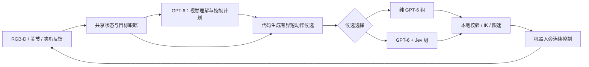

# 🤖 双臂 Piper 真机部署方案

**先用一只手完成“推软块到目标区”和“抓方块放托盘”，再扩展双臂分区搬运。** GPT-6 Astra 负责视觉理解与任务计划；混合组用 Jev 选择短动作和恢复方式；两组共用本地感知、技能、运动控制及停止逻辑。

**这是待实施方案，尚未完成本项目的 Piper 真机闭环。** 2026-09-22 已暂停模型实验，当前只做代码与部署准备。已有仿真视频不能当作真机验证。

## 1. 先确认设备，再决定驱动

本地保存的远程工作区表明已有 Piper 相关工程，但只读 SSH 身份认证尚未通过。**尚未确认操作系统、GPU、ROS 版本、机械臂型号／数量、CAN 状态或相机配置。** 不公开私人主机、用户名、设备序列号及远程路径。

| 项目 | 第一阶段所需 | 开工前确认内容 |
| --- | --- | --- |
| 控制主机 | 机械臂旁的 Linux 主机；Mac 查看画面、报告与开发 | Ubuntu／内核、Python、既有 ROS 与驱动版本；不能由工作区名字推断 |
| 机械臂 | 先接一台 Piper，第二台保持独立停放 | Piper／Piper-X、固件、夹爪、安装方向、零位、机械限位与额定负载 |
| 通信 | 两臂各自可辨认的 CAN 通道与唯一写入进程 | USB-CAN 型号、通道与左右臂映射、比特率、反馈周期；禁止两个程序同时发命令 |
| 视觉 | 首选固定外部 RGB-D 相机，能看清全桌；腕部相机后加 | 相机型号、RGB／深度对齐、内参、深度单位、外参、时间戳 |
| 场地 | 固定底座、平整桌面、大目标区、软块与低边托盘 | 实测工作区、桌高、线缆走向、双臂间距；在机器人本地保存配置 |
| 人机停止 | 已验证的实体急停与现场操作者 | 停止覆盖哪些轴／夹爪，保持／断使能后的状态及恢复步骤 |

**第一版不依赖 RTX 4090。** 可先用 RGB-D、颜色／标记跟踪和云端模型完成小场景，明确公布这种感知设定。DINO／SAM3 等本地感知模型作为后续独立升级，先核实 GPU 与安装条件；不把更换感知的收益归给 Jev。

驱动优先复用设备已验证的官方 SDK 或 ROS 路径，选其中一个作为硬件写入者。若原工程 ROS 控制已稳定，增加节点适配；若没有，先建立最小 SDK 桥接。核对的官方 ROS 分支面向 **Ubuntu 20.04／ROS Noetic**，不能据此假定当前主机已装 ROS 2 或把安装脚本直接用于其他系统。SDK 的 CAN 支持与 ROS 的话题、单位、版本应逐项核实。

## 2. 两种模式的分工

| 层 | 两组共同做法 | 比较的差异 |
| --- | --- | --- |
| 感知 | 相同相机、RGB-D 处理、跟踪器、夹爪反馈；信息附时间和有效性 | 无 |
| 高层计划 | GPT 识别物体与目标，输出技能计划及完成条件 | 无 |
| 候选 | 代码按当前几何与技能生成 2–3 个可执行短段，例如接近、侧移重新接触、退回观察位 | 无；候选坐标和方向由代码计算 |
| 选择 | 输入相同字段：候选、近期物体位移、目标误差、可见性、夹爪状态、执行结果 | GPT 或 Jev 选择候选、速度档位或重新观察 |
| 执行／评价 | 相同控制频率、速度、有效期、停止条件与成功判定 | 无 |

这里“纯 GPT-6”指**模型决策仅使用 GPT-6，仍有代码控制器与视觉几何处理**。它不是让 GPT 直接输出电流或逐周期关节指令。主对照只替换选择器；若另测 GPT 一次请求同时规划和选择，单列为不同协议。

**Jev 的潜在价值是以较低开销选择下一步及恢复方式，收益需要实测。** 它不直接接收 RGB，也不重复计算 XYZ 误差符号。优先验证“物体是否推进”“是否值得换接触点”“是否需要新画面”，不用额外的模型调用包装确定性算术。

高层 GPT 在首次见到场景、目标丢失、计划失效或恢复后调用；正常跟踪由本地相机持续更新。两组使用同一事件规则。短段结束再调用选择器，**不在每个控制周期请求 API**；如果没有可靠跟踪证据，就重新观察，不无限复用旧视觉判断。先实现该节约机制再测，不能仅因 Jev 单次便宜就宣称系统更便宜。

## 3. 模型等待时，机器人如何运行

分成三个独立循环：相机与反馈采集、本地执行、远程推理。网络等待不阻塞采集与本地停止检查。

1. **本地执行的启动目标为 50 Hz。** 先测驱动支持与实际抖动；这不是已验证的实时保证，也不是电机内部伺服频率。第一轮空载建议平移上限 20 mm/s，接近物体 10 mm/s；最终值由设备与台面试验确认，两组完全相同。
2. **每次接受一个短段。** 初始建议每段最多 10 mm 或 0.5 s，先到者结束；到达端点立即保持，不沿原方向外推。起步阶段固定姿态，旋转单独标定后开放。
3. **等待下一次 API 时，只完成仍有效的当前短段，随后保持。** 不为了掩盖模型延迟一直移动。模型超时不能自动重复原指令。
4. **区分响应过期和执行过期。** 响应绑定 `episode_id / generation / observation_id / candidate_set_id`；暂停、重置、目标丢失后旧响应作废。返回后用最新观测重新检查候选适用条件；目标变化或观测不可用就丢弃。接受后才启动短段的本地有效期。
5. **本地停止覆盖全部执行器。** 反馈超龄、驱动故障、目标出界、跟踪丢失、夹爪状态异常或人工停止，清空动作队列并进入设备已验证的停止／保持状态；不自动打开夹爪，也不把突然断使能当通用处理。反馈超龄阈值需根据实测频率设定并冻结。
6. **失联时不等待云端判断。** 看门狗独立于模型线程；模型进程崩溃、网络断开和迟到响应都在离线／空载阶段注入验证。实体急停独立存在，GPT、Jev 和软件看门狗均不能替代它。

Jev-as-Policy 可以借鉴连续执行、端点约束、命令失效与 generation 机制；其 3 秒命令与 14 cm/s 仿真速度**不直接移植到真机**。

## 4. 必须补齐的状态与坐标

**先解决“看到了哪里、真的碰到了吗、物体动了吗”。** TCP 移动不等于物体推进；上一条抓取指令不等于已经抓住。

| 数据 | 获取及约束 |
| --- | --- |
| 关节／末端 | 时间戳、关节角、末端位姿、驱动错误；统一内部 SI 单位（m、rad），SDK 边界单独转换 |
| 夹爪 | 实测开口、闭合指令、稳定时间；若固件提供有效的电流／力矩反馈则一起记录，不能把控制设定值当测量 |
| 接触／抓住 | 开口受阻只作为候选证据；结合物体跟随与短距离试抬判断。没有力传感器就不报告“实测接触力” |
| 物体进展 | 固定外部相机跟踪物体相对桌面／目标的位置，并记录置信度、遮挡和失效；腕部画面变化不能直接当作物体移动 |
| 标定 | 相机内参、深度比例、相机到桌面、桌面到左右基座、法兰到 TCP；保存版本及误差 |
| 双臂 | 公共桌面坐标系、每臂占用区域、计划短段的扫掠范围；检查整个臂体，不只检查 TCP 间距 |

坐标约定写入配置：`T_A_B` 表示把 B 坐标变换到 A；固定相机定位使用 `p_base = T_base_camera × p_camera`，腕部相机再组合当前法兰位姿。深度必须与所取 RGB 像素对齐；无效／反光深度应拒绝或重新观察，不能默认成桌高。

开始时用标定板与已知位置点验证重投影及三维误差，至少覆盖计划工作区的中心和边缘。**先记录真实误差，再据此扩大目标区和选物体尺寸**；不把“标定完成”直接等同于毫米级准确。

## 5. 两个最先做的任务

| 任务 | 布置与技能 | 成功标准 | 主要验证 |
| --- | --- | --- | --- |
| **A：推软块到目标区** | 单臂；约 5–7 cm 的轻质软块；平桌上约 15 cm 的目标区；初始距离约 10 cm；接近 → 侧面接触 → 短推 → 退出 | 软块完整进入目标区，机械臂退出，连续稳定 2 s；人工核对录像 | 看准目标、建立接触、测物体推进与换接触点；没有抓取环节 |
| **B：方块放进低边托盘** | 单臂；不反光、可稳定夹持的约 4 cm 轻块；宽约 20 cm 的低边托盘；顶抓 → 确认夹持 → 低高度搬运 → 放下 → 退出 | 方块在托盘内稳定 2 s，夹爪释放并退出；不以模型自报成功为准 | 夹爪反馈、短距离试抬、掉落发现与放置稳定性 |

尺寸是起步建议，应依据实际夹爪开口、相机误差和工作区调整。先固定物体类别与姿态，后增加位置扰动；不用抽屉、微波炉、反光件、精密插接或双臂交接作为第一项真机任务。

首个双臂任务为**两臂各自把软块放入各自托盘**：左右工作区不重叠，先交替再并行。确认共用坐标系、全臂碰撞检查、停止传播与调度后，才考虑“左臂放在中转垫、退出，右臂再取走”；直接空中交接另立阶段。

## 6. 按四个阶段落地

| 阶段 | 实际工作 | 进入下一阶段的依据 |
| --- | --- | --- |
| **0 · 无力矩／不发运动命令** | 版本清点；相机标定；拆分只读连接与使能；离线回放观测；虚拟硬件检查单位、限位、过期与乱序响应 | 没有隐式使能；可重复回放；无效命令被拒绝；故障和恢复过程有记录 |
| **1 · 单臂空载** | 现场操作者在场；低速已知点跟踪；测试暂停、断网、进程退出、反馈丢失；验证夹爪停止行为 | 实测轨迹误差、延迟和停止距离可接受；工作区内重复运行；左右臂映射确认 |
| **2 · 单臂单物体** | 先用确定性技能完成 A／B，再接 GPT，最后接 Jev；两组共享参数 | 能区分看错／选错／执行偏差；抓取与推进具有实际反馈；冻结协议后再计成绩 |
| **3 · 双臂** | 分区交替 → 分区并行 → 桌面中转；每次只增加一种协调因素 | 两臂故障联动、共享区互斥、轨迹检查和观测遮挡处理均通过验证 |

今天不执行上述真机步骤。后续有现场操作者、完成设备确认后才开始硬件动作；后台准备仅限代码、离线回放与文档。

## 7. 开源代码如何复用

| 来源 | 可复用 | 本项目仍需实现／核验 |
| --- | --- | --- |
| [Piper SDK · c9e8a28](https://github.com/agilexrobotics/piper_sdk/tree/c9e8a28174e71eeaac448593cb65f8ab258a92fe)／[Piper ROS · ac41fcb](https://github.com/agilexrobotics/piper_ros/tree/ac41fcbcdda598f01b51cf6175ed9a24d0dacadc) | 厂商通信、反馈、模型及控制入口 | 固件兼容、精确单位、CAN 映射、使能／停止语义、单一写入者；不由云端控制生命周期 |
| [RobotKitAI/piper-astra-jev · 10d671e](https://github.com/RobotKitAI/piper-astra-jev/tree/10d671e01d467475084033e7af9f6595886ab7b3) | Piper＋RGB-D＋技能组织；相机深度对齐与坐标反投影；夹爪开口受阻才允许抬升 | 作者报告 8 次真机演示，非配对成功率。Astra 与 Jev 使用不同感知，不能作为公平对照；初始化会使能／重置，必须拆分 |
| [control_your_robot · 49be484](https://github.com/Tian-Nian/control_your_robot/tree/49be4846c66adf3d98c7c3ec78acd3d1d8aeb577) | 现有双臂 Piper／RealSense 抽象、HDF5 采集、后续 VLA 数据格式 | 修正连接副作用、姿态转换、默认速度、时间同步、看门狗与反馈；示例不是可直接部署的安全桥 |
| [Jev-as-Policy · cac97e7](https://github.com/YuanKJing/Jev-as-Policy/tree/cac97e79845bf56a5b2ef0e6d4928238bf5caee7) | 本地连续伺服、端点约束、命令有效期、暂停时失效旧响应 | 该仓库使用 MuJoCo 真值且无硬件驱动；不能照搬接触判断、Panda IK 或仿真速度 |
| 本项目 LIBERO／计费与导出 | 结构化选择、观测证据、调用计量、逐局结果与展示页 | 真机异步执行、驱动／相机桥、目标跟踪、实测成功判断与双臂调度尚待新增 |

现有 `control_your_robot` 代码核对发现三个需要先处理的问题：

- `PiperController.set_up()` 会调用 `EnableArm`，其使能循环还会闭合夹爪；必须拆成**只读连接**与**显式使能**两个操作。
- `get_state()`／`set_position()` 把平移和欧拉角统一缩放，违背它自身的 m／rad 接口声明；官方 SDK 的 XYZ 为 **0.001 mm**，RX／RY／RZ 为 **0.001°**。写入时分别用 `位置_m × 1e6` 与 `角度_rad × 180/π × 1000`；例如 0.1 m 为 100000，而 90° 为 90000。反馈按各自单位反向转换，欧拉顺序仍须确认。[官方接口](https://github.com/agilexrobotics/piper_sdk/blob/c9e8a28174e71eeaac448593cb65f8ab258a92fe/piper_sdk/interface/piper_interface_v2.py#L2652)
- 运动函数写死速度参数 `100`；双臂示例的相机序列号是占位符，默认关闭深度。需要设备配置、限速、RGB／深度对齐与时间戳，不运行原示例的自动动作入口。

另有三个已核实的接口细节，决定如何写桥接：

- 官方 SDK `GetArmJointMsgs()`／`GetArmEndPoseMsgs()`／`GetArmGripperMsgs()` 返回反馈及时间戳、频率；`GetArmGripperMsgs()` 包含开口、力矩字段与驱动状态。`MotionCtrl_2` 的速度是 **0–100 百分比**，不是 m/s；几何限速与驱动百分比都要控制。`ConnectPort()` 默认执行初始化，纯接收路径需显式核对 `piper_init=False` 与构造器行为，不能只按方法名判断只读。
- 官方 ROS 的 **`/joint_states` 是运动命令入口，`/joint_states_single` 才是关节反馈**；默认 launch 的 `auto_enable=true` 必须改成显式配置。README 对 `/stop_srv` 描述为阻尼下落，对 `/reset_srv` 描述为掉电下落；SDK `ResetPiper()` 也明确说明会失电。桥接不能把这些直接映射成普通“暂停”。[ROS 接口](https://github.com/agilexrobotics/piper_ros/blob/ac41fcbcdda598f01b51cf6175ed9a24d0dacadc/README.MD#L188)
- RobotKitAI 的 `Arm()` 构造器会激活 CAN，可能按其特定机器状态重设第 3 关节零位，并重置机械臂／夹爪；`close()` 会折叠再断使能。这些均**不能作为本项目默认初始化或退出行为**。其 `holding()` 本质是闭合指令加开口阈值，不是力传感器；其手眼标定允许约 10 mm 残差，不等于通用精密标定。[机械臂封装](https://github.com/RobotKitAI/piper-astra-jev/blob/10d671e01d467475084033e7af9f6595886ab7b3/piper_llm/arm.py) · [标定实现](https://github.com/RobotKitAI/piper-astra-jev/blob/10d671e01d467475084033e7af9f6595886ab7b3/calibrate.py)

本项目建议新增 `piper_bridge`（驱动与状态）、`piper_perception`（标定与跟踪）、`piper_skills`（短段与执行条件）、`piper_compare`（双模式与计量）。这些名称是模块规划，**尚无可执行的真机启动命令**。先做最小 SDK／ROS 适配，保留 `control_your_robot` 的采集格式；不要为第一轮实验安装完整 VLA 训练栈。

## 8. 比较怎么记，预算怎么定

先做每任务 2 个开发位置 × 2 模式，共 **8 局试运行**；只用来调试。冻结实现后，建议每任务 10 个新的位置 × 2 模式，共 **40 局正式对照**。每对使用放置模板复原相同物体姿态，记录实际初态误差；交替先后顺序，避免一组总在相机或网络状态更好的时段运行。

**建议起步上限：每局 600 s、最多 6 次视觉规划、20 次选择、3 美元 API 估算费用，任一到限即结束。** 首批 8 局总费用上限 24 美元；实际价格与传输异常计费须在开跑前确认。这是未来协议提案，不是今天启动的付费授权或耗时承诺。长时间物体无进展只允许有限次恢复，不持续推满预算；阈值在开发局确定后冻结。

| 必报数据 | 定义 |
| --- | --- |
| 成功率 | 正式协议下所有局均计入；标出样本数，失败与人工介入不剔除 |
| 总时间 | 从首次用于决策的观测到终止；包含 API 等待、感知、恢复及实际运动；另报运动／等待占比 |
| 总费用 | GPT 视觉＋GPT／Jev 选择＋重试；记录实际模型版本、计费来源与日期。估算费用和供应商实账分开 |
| 请求／token／延迟 | 两层分别统计，合计总请求与输入输出 token，记录 p50／p95；未知用未知，不补零 |
| 控制质量 | 控制周期抖动、反馈／图像年龄、过期响应丢弃数、限位／停止、夹爪异常、恢复和人工介入 |
| 物理结果 | 物体位移、最终目标误差、抓取稳定／掉落、成功条件与录像；不以 TCP 轨迹代替物体轨迹 |

模型决策失败原样计分。纯通信异常允许重试，但保留失败次数与已知花费汇总；正式比较不靠“重复到成功”挑出最好的一局。若 Jev 成功率下降而只减少选择费用，应直接报告取舍，继续检查输入、候选和恢复逻辑。

发布时展示**两种模式的并排录像、真实墙钟、决策、总费用和成功判定**。公开设备型号、软件／协议版本、标定误差与任务布置；隐藏内网信息、凭据及相机序列号。第三方复现需有贡献者、账号、日期、任务、设备、版本与结果来源，单次演示明确标记为演示。
