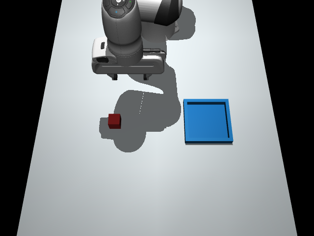
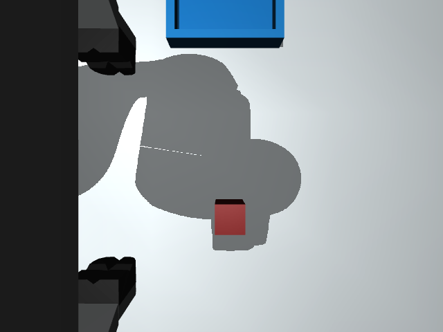
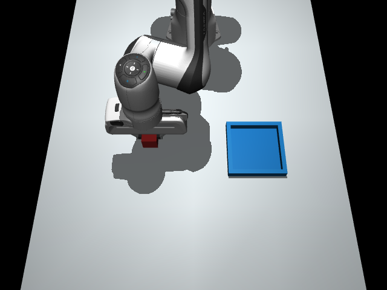

# 模型看图之后，怎样选择下一步？

这里展示两个真实的双相机视觉回合：一局完成普通搬运，另一局在失去抓取接触、托盘又被移动后，重新抓取并完成任务。模型每轮看当前图像，从 21 个 XYZ 短步和夹爪动作中选一个；程序执行后，再把新的观察交给模型。

[🎬 看视频与动图](DEMOS.md) · [自己跑一局](PLANNING.md) · [完整数据报告](results/planning-2026-09-20.json)

## 看图完成一次搬运

模型先靠近方块，闭爪后抬起并搬向托盘，最后松爪、撤离。全局执行 **32 个动作，收到 32 次真实模型回复**，物理判定成功。

| 记录 | 结果 |
| --- | --- |
| 实验耗时 | 235.41 秒 |
| 输入 / 输出用量 | 140,800 / 4,320 tokens |
| 最终末端高度 | 约 0.198 m，超过要求的 0.17 m |
| 相机存档 | 33 次采样，66 张原始 PNG |
| 下载 | [下载 MP4](https://github.com/FBddcz/embodied-jev/raw/refs/heads/main/docs/media/vision-transfer.mp4) · [实验 JSON](results/planning-vision-gpt6-v2-cameras-transfer.json.gz) · [相机 ZIP](results/planning-vision-gpt6-v2-cameras-transfer-cameras.zip) |

模型没有拿到方块和托盘的坐标，也没有预先给定的抓取、搬运阶段。它得到的是相机图像、标定、机器人自身状态和近期动作结果。记录帧中未发现禁止接触标志。

## 托盘移动后，重新抓取并调整路线

这局在第 20 步后启用了一次外部扰动：测试程序把托盘底面、围边和评测目标一起沿世界 X 方向移动 **6 cm**。模型随后收到新画面，没有收到新目标坐标或“向 X 移动”的指令。

在扰动之前，执行中还出现了双指接触丢失。它没有被预先安排，与托盘移动是两件不同的事。

| 动作时刻 | 实际发生了什么 |
| --- | --- |
| 第 19 步后 | 双指接触丢失，机器人不再被判定为持物 |
| 第 20 步 | 模型选择张爪；动作结束后，测试程序移动托盘 |
| 第 21–24 步 | 模型微调位置并下降 |
| 第 25 步 | 模型选择闭爪，双指接触恢复 |
| 第 26–38 步 | 继续抬升、搬运和对齐；第 32、34 步分别选择 X +40 mm、+10 mm |
| 第 39–43 步 | 松爪并撤离，物理判定成功 |

重新抓取由模型逐步选择的动作完成，程序没有调用预设恢复技能。全局 **43 个动作、43 次模型调用**，用时 **342.21 秒**；输入 / 输出为 **189,594 / 6,037 tokens**。最终末端高度约 0.193 m，记录帧中未发现禁止接触标志。

[⬇ 下载 MP4](https://github.com/FBddcz/embodied-jev/raw/refs/heads/main/docs/media/vision-recovery.mp4) · [实验 JSON](results/planning-vision-gpt6-v2-live-target-shift-run1.json.gz) · [相机 ZIP：45 次采样、90 张 PNG](results/planning-vision-gpt6-v2-live-target-shift-run1-cameras.zip)

这一局能核对“反馈变化—新动作—实际恢复”的过程。不过，两种变化发生在同一回合，不能把增加的步数完全归因于其中一种，也不能由这一局推算恢复成功率。普通实验默认不施加扰动，设置方法见[规划指南](PLANNING.md#托盘为什么会自己移动)。

## 两台相机实际看到了什么？

下面是普通搬运回合的原始 PNG。初始状态的 `capture_id=1`，搬运状态的 `capture_id=15`，对应第 14 个动作之后。

| 时刻 | 外部相机 | 腕部相机 |
| --- | --- | --- |
| 初始 |  |  |
| 搬运中 |  |  |

外部机位固定，机械臂和物体在画面中移动；腕部机位随手移动，也会被手指、手掌遮挡。相机在动作边界采样，等待模型回复时保持当前画面。视频右侧展示的是各步模型输入，详见[画面说明](DEMOS.md#画面各部分是什么意思)。

每份记录中的图像视角、采样编号、字节长度和 SHA-256 都与相机 ZIP 核对过。四种相机配置也经过实际渲染检查：未启用的相机不采集，启用的视角会在运动后更新，腕部标定随手变化。这些检查确认了图像来源和更新过程；模型对各个视角的依赖程度，还需要移除图像、单相机等成对实验来测量。

## 哪些尝试没有完成？

成功演示之外，失败与接口错误也保留在[完整报告](results/planning-2026-09-20.json)中。

| 条件 | 动作数 / API 调用数 | 结果 |
| --- | --- | --- |
| v1 提示，无扰动 | 32 / 32 | 放入托盘后只撤离到约 0.118 m，未达到 0.17 m，最终停滞 |
| v2 提示，无扰动的一次尝试 | 2 / 3 | 第 3 次请求 `ReadTimeout` |
| v2 提示，计划移动目标的一次尝试 | 0 / 1 | 首次请求超时，扰动尚未发生 |
| 显式规则对照，仿真状态输入并移动目标 | 40 / 0 | 完成；没有视觉模型参与 |

v1 没有向模型说明最终撤离高度。v2 补充了完整的目标条件：物体在目的地稳定至少 0.4 秒、夹爪松开且不再持物、末端高度至少 0.17 m。它没有增加阶段、航点或动作顺序。提示条件发生过变化，因此这些开发回合不合并计算成功率；规则对照有物体坐标，也不能当作相同输入条件下的模型排名。

## 实验设置与复现

实验日期为 2026-09-20。两个成功演示的共同设置如下：

| 项目 | 设置 |
| --- | --- |
| 任务 / 种子 | `transfer` / 7 |
| 控制 / 观察 | `incremental` / `vision`，外部＋腕部 RGB |
| 请求 / 响应模型名 | `gpt-6-astra` / `gpt-6-astra-2026-09-03`，来自 API 配置与响应 |
| 提示版本 | `incremental-planning-v2` |
| 动作菜单 | 21 个固定选项，每轮打乱排列；没有任务阶段 |
| 安全预演 / 概率门槛 / 预算 | 开启 / 0 / 80 步 |
| 展示节奏 | 普通回合 headless `speed=0`；扰动回合工作台 `speed=4` |

两局的展示等待不同，整局耗时不能直接用于比较推理速度。视频另做了播放节奏调整，也不代表实时速度。源文件哈希、逐步输入和轨迹均保存在[机器可读报告](results/planning-2026-09-20.json)及其引用的原始文件中。

```bash
# 使用界面保存的 Chat 连接；会产生真实 API 调用
python scripts/planning_trial.py --saved-connection --cameras both \
  --shuffle-candidates --max-cycles 80 --output runs/vision-transfer

# 第 20 步后将目标沿 X 移动 6 cm
python scripts/planning_trial.py --saved-connection --cameras both \
  --shuffle-candidates --max-cycles 80 \
  --intervention '{"kind":"target_shift","after_cycle":20,"delta_xy":[0.06,0]}' \
  --output runs/vision-target-shift
```

脚本不覆盖旧目录，失败也会保存。仿真器仍负责本体反馈、安全检查与最终评分。这些模型实验只涉及同一任务和种子，尚无未知物体、跨任务、单相机或真机评测。早期的[预设技能九局实验](GPT6_EXPERIMENT.md)和 RGB-D 检测实验采用不同输入与控制方式，成绩单独列在[结果总览](VALIDATION.md)。
