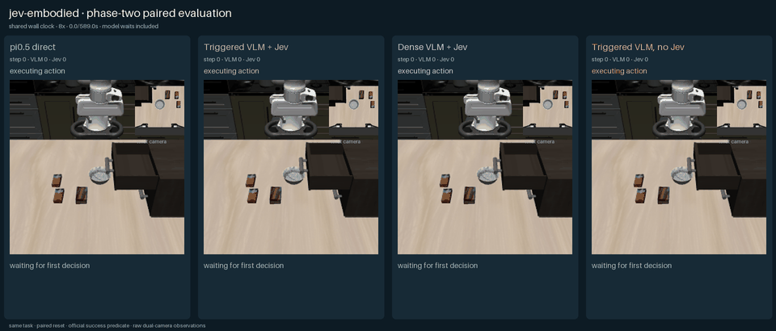
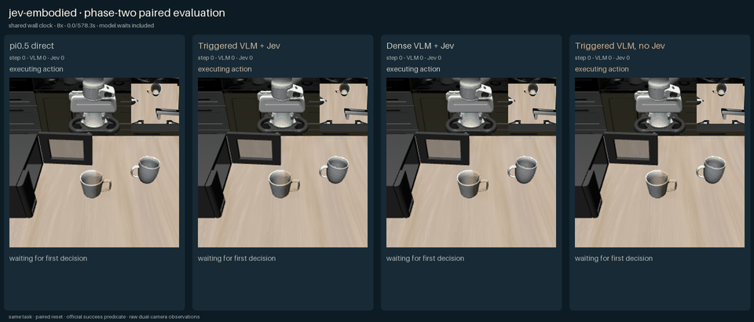

# 二阶段 v4：任务无关视觉关键帧与连续动作块

2026-10-05 在双卡 NVIDIA H20 服务器上完成了 2 个 LIBERO-90 开发用例、4 条路线的配对实验。本轮把旧版任务命名宏技能替换为统一的连续 `H×7` 动作块：Qwen3.5-27B 只输出相机坐标系视觉关键帧，已知相机标定负责坐标变换，通用生成器提出数值动作块，Jev 从中选择要执行的精确数组。

## 结论

- `π0.5` 成功 1/2；`VLM + Jev` 按需、`VLM + Jev` 逐轮和无 Jev 名义动作块路线均为 0/2。
- v4 已经消除了任务命名技能，并让四条路线最终都通过相同的连续 `H×7` 动作接口控制机器人；但接口对齐不等于能力对齐，混合路线仍未形成可靠的目标定位与接触轨迹。
- Jev 并非固定放行 VLM 的名义动作：按需路线的 160 次动作块决策中，选择了 86 次谨慎、36 次保持、32 次恢复，仅 1 次名义、4 次图像平面修正和 1 次夹爪动作。
- 按需路线相对逐轮路线减少了 19.4% 的 VLM 请求（129 vs 160），平均端到端时间降低 14.9%（502.06 s vs 589.99 s），但没有改善成功率。
- 样本只有两个固定初始状态，因此这是系统级开发实验，不是 LIBERO 榜单结论。

## 汇总指标

| 路线 | 成功 | 平均步数 | 平均端到端时间 | VLM 请求 | Jev 请求 |
|---|---:|---:|---:|---:|---:|
| π0.5 direct | 1/2 | 323.5 | 68.07 s | 0 | 0 |
| Triggered VLM + Jev | 0/2 | 400.0 | 502.06 s | 129 | 219 |
| Dense VLM + Jev | 0/2 | 400.0 | 589.99 s | 160 | 160 |
| Triggered VLM, no Jev | 0/2 | 400.0 | 189.93 s | 40 | 0 |

## 逐局结果

| 用例 | 路线 | 结果 | 步数 | 端到端时间 | VLM / Jev |
|---|---|---:|---:|---:|---:|
| 关闭抽屉 | π0.5 | 失败 | 400 | 84.43 s | 0 / 0 |
| 关闭抽屉 | Triggered VLM + Jev | 失败 | 400 | 507.24 s | 64 / 107 |
| 关闭抽屉 | Dense VLM + Jev | 失败 | 400 | 595.40 s | 80 / 80 |
| 关闭抽屉 | Triggered VLM, no Jev | 失败 | 400 | 188.09 s | 20 / 0 |
| 关闭微波炉 | π0.5 | **成功** | 247 | 51.70 s | 0 / 0 |
| 关闭微波炉 | Triggered VLM + Jev | 失败 | 400 | 496.88 s | 65 / 112 |
| 关闭微波炉 | Dense VLM + Jev | 失败 | 400 | 584.57 s | 80 / 80 |
| 关闭微波炉 | Triggered VLM, no Jev | 失败 | 400 | 191.77 s | 20 / 0 |

## 动态对照

四列共享任务、初始化、相机、步数上限和官方成功判定。动画采用共享墙钟，包含模型等待时间。

关闭抽屉：

[MP4](media/drawer-init0/comparison.mp4) · [首帧海报](media/drawer-init0/poster.png) · [末帧](media/drawer-init0/final.png)

关闭微波炉：

[MP4](media/microwave-init0/comparison.mp4) · [首帧海报](media/microwave-init0/poster.png) · [末帧](media/microwave-init0/final.png)

## 控制接口

混合路线没有抽屉、微波炉或把手等任务专用技能。每次规划与决策按以下通用接口完成：

1. Qwen3.5-27B 根据任务文本、双相机 RGB 和本体状态，输出阶段、相机坐标轴上的平移/旋转方向、夹爪意图、幅度与计划时域。
2. 已知相机内外参把相机方向变换到机器人世界坐标；控制器没有使用场景深度、物体位姿或成功信号。
3. 通用生成器产生保持、谨慎、名义、激进、图像平面、相机深度、旋转、恢复和夹爪等数值 `H×7` 候选块。
4. Jev 选择精确候选数组；无 Jev 对照固定选择名义动作块。执行器滚动执行动作块前缀，再根据调度条件重新规划。

按需路线在首次决策、计划到期、Jev 低置信、视觉与本体联合停滞，以及保持/恢复动作之后重新调用 VLM；逐轮路线每次 Jev 决策前都重新调用 VLM。

## 结果解释

这次实验回答了两个不同问题：

1. **接口是否公平。** 是。混合路线不再依赖任务命名宏技能，最终输出与 π0.5 一样是连续 7 维动作块。
2. **能力是否已经相当。** 否。Qwen 的 RGB 相机方向在闭环中不够稳定，Jev 因而大量选择谨慎、保持和恢复，仍未形成可靠接触。Jev 可以在候选中纠偏和降低规划频率，但无法从几何上修复一个不稳定的视觉目标。

下一步应继续保持任务无关接口，重点增强视觉关键点/目标位姿估计和接触阶段反馈，或让本地模型直接提出学习得到的运动候选；不应退回任务专用宏技能。

## 完整性与限制

- 8/8 个 episode 正常结束，无安装、服务或接口错误；失败均为达到 400 步预算。
- 每个用例四条路线的初始状态指纹完全一致。
- 共记录 3,055 帧、610 次决策、329 次 VLM 请求和 379 次 Jev 请求。
- VLM 为服务器本地 `Qwen/Qwen3.5-27B`；π0.5 使用本地官方 checkpoint；Jev 1.13.0 暂时通过远端 API 调用。
- 只有 2 个任务、每个任务 1 个初始状态，不能据此估计总体成功率。
- API 密钥未写入结果文件、媒体元数据或仓库。

[机器可读指标](metrics.json) · [冻结实验协议](protocol.json)
