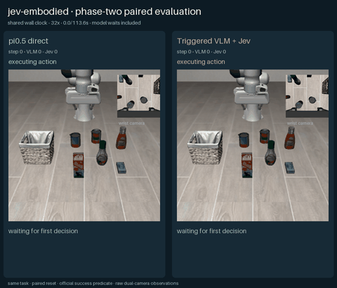
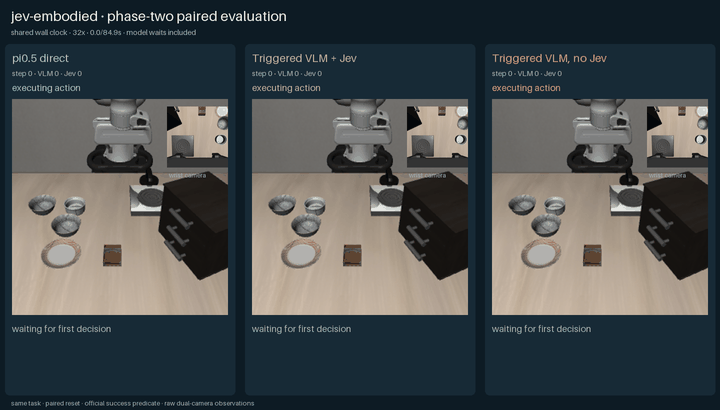
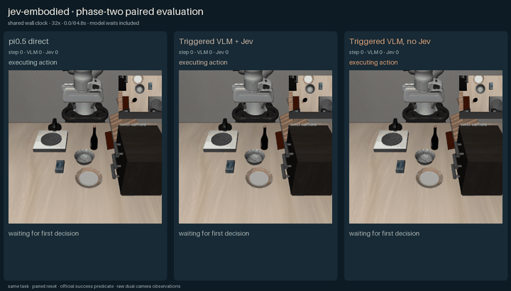
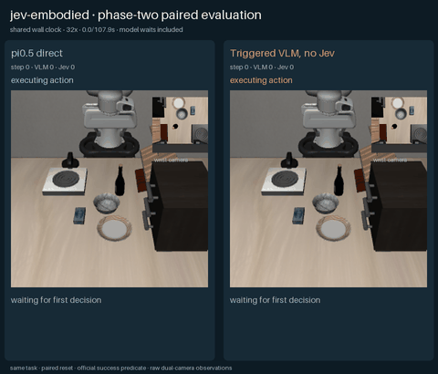

# 二阶段通用化实验（2026-10-07）

## 结论

这轮把上一版仅针对“抓起后放入篮子”的控制器扩展为统一的视觉关系关键帧：同一份代码可表达 `grasp`、`release`、`push`、`pull`、`rotate` 和主动观察，不再读取静态物体纹理、不使用任务命名宏技能，也不依赖候选区域编号。Qwen3.5-27B 直接在完整双相机图像上给语义像素、交互类型、目标关系和运动方向；RGB-D 层构造连续 `H×7` 候选，Jev 只在这些具体动作块之间裁决。

但正式冻结评估没有通过：开发集和未见 holdout 上，π0.5 都是 5/5，通用 VLM+Jev 都是 0/5。因此本轮证明了接口和失败诊断覆盖面扩大，不能声称已经达到 VLA 的任务泛化能力。

| 数据集 | 模式 | 官方成功 | 平均环境步数 | 平均墙钟时间 | VLM 请求 | Jev 请求 |
|---|---|---:|---:|---:|---:|---:|
| 开发 5 任务 | `pi05` | 5/5 | 106.4 | 37.75 s | 0 | 0 |
| 开发 5 任务 | `vlm-chunk-no-jev` | 0/5 | 320.0 | 81.39 s | 66 | 0 |
| 开发 5 任务 | `vlm-jev-triggered` | 0/5 | 233.0 | 113.83 s | 109 | 233 |
| 未见 holdout 5 任务 | `pi05` | 5/5 | 103.4 | 46.21 s | 0 | 0 |
| 未见 holdout 5 任务 | `vlm-jev-triggered` | 0/5 | 37.0 | 75.21 s | 49 | 37 |

成功只取 LIBERO 官方 `env.check_success()`；接近、抓住、推动或模型自评都不算成功。`complete: false` 表示部分混合轨迹被视觉/RGB-D 安全校验中止，而不是缺少结果；所有 15 个开发局和 10 个 holdout 局都有明确官方布尔结果。

## 冻结任务

开发集在修改前固定，覆盖五种不同关系：沙拉酱放入篮子、指定黑碗放到盘子、打开中间抽屉、把盘子推到炉灶前、打开炉灶。holdout 在开发结束前固定且不用于调参：牛奶放篮子、空间指代碗放盘子、酒瓶放柜顶、碗放盘子、酒瓶放架子。π0.5 在十项上均成功，说明任务、初态、仿真服务和官方谓词本身可执行。

## 本轮实际改进

- 去掉任务盲候选区域和 LIBERO 静态纹理匹配。Qwen 直接输出完整图像上的归一化语义像素，独立三票裁判验证 crop、交互类型和运动方向。
- 使用动态支撑面和深度连通组件，不再假设固定桌高；薄物体使用 3 mm 支撑面分离阈值。
- 抓取采用高位 XY、下降、闭爪、夹紧、抬升；释放采用抬高、平移、下降、张爪，并支持 `inside/on/at`。
- `push/pull/rotate` 支持单轴和四个对角图像方向、接触状态跨动作块保持、附着机构与自由物体分离。
- Jev 获得最近动作家族和实测状态变化；重复无效家族时被要求改选直接接触、更强动作或姿态探测。低置信度只有与物理停滞同时出现才触发 VLM。
- 增加 20 项回归测试，覆盖闭爪包络、释放层级、持续接触、推压方向、旋转和姿态探测。

## 为什么仍然失败

失败已经不是单一的“识别不到物体”，而集中在三个结构性问题：

1. **6D 末端姿态不足。** 当前关键帧可靠表达 XYZ 接触与图像平面方向，但没有学习式绝对末端姿态。推薄盘、拉侧向把手和旋钮旋转需要位置与旋转联合控制；π0.5 的成功轨迹会持续改变后三个旋转通道。
2. **遮挡后的视觉闭环脆弱。** 机械臂接近后会遮挡源物体或把手。重新调用 VLM 可能把像素落到机器人、桌面或目标容器边缘；裁判会安全拒绝，但轨迹因此中止。
3. **Jev 只能在候选集中选。** Jev 能避免部分重复谨慎动作，也能选择 `direct_contact`/`assertive`，但候选缺少正确 6D 姿态时，它无法创造 VLA 那样的新动作。开发集里 Jev 没有提高官方成功率，且平均墙钟时间高于无 Jev 路线。

这也是停止继续添加小规则的原因：再针对某个盘子、旋钮或抽屉调整坐标与旋转，会提高单例成绩却降低“同一段代码”的可信度。下一阶段应让本地策略学习 SE(3) 接触姿态或短时动作残差，再让 Jev 做风险/候选裁决，而不是继续扩充手写几何分支。

## 动态回放

沙拉酱抓放（π0.5 与 VLM+Jev）：

空间指代碗放盘子（三路线）：

打开抽屉（三路线）：

推盘子到炉灶前（三路线）：

打开炉灶（π0.5 与无 Jev；Jev 在第 0 步被控制件 crop 校验拒绝，无可渲染轨迹）：

GIF 使用共享墙钟渲染并包含模型等待时间。服务器完整逐步帧和 MP4 已归档到 `/mnt/oss/users/zyh/runs/phase2-v7-generalization-final-20261007`。

## 可复现材料

[机器可读指标](metrics.json)；[开发集 π0.5 原始报告](raw/pi05-dev-report.json)；[开发集混合路线原始报告](raw/hybrid-dev-report.json)；[holdout π0.5 原始报告](raw/pi05-holdout-report.json)；[holdout 混合路线原始报告](raw/hybrid-holdout-report.json)。对应 protocol JSON 保存在同一 `raw/` 目录，记录源码哈希、预算、模型端点和清单。

上一轮 2 个特定抓放任务 8/8 的结果仍保留在[参考外观 grounding 报告](../phase2-reference-grounded-2026-10-06/RESULTS.md)。它与本轮并不矛盾：上一轮验证了窄任务族可行性，本轮说明去掉这些假设后，尚缺学习式 6D 控制能力。
