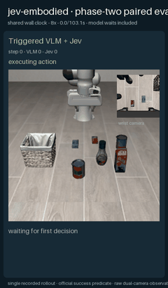
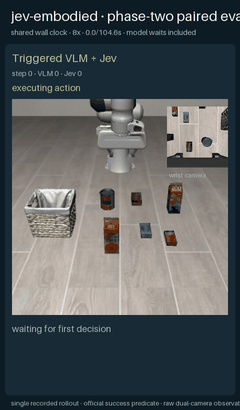
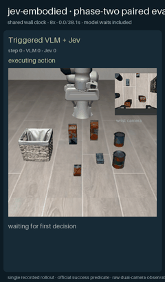
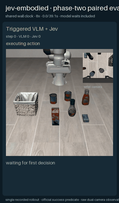

# 二阶段最小假设补充实验（2026-10-07）

## 结论

在完全通用版 VLM+Jev 为 0/5 后，本轮没有加入任务名坐标或物体专用宏技能，而是增加一个显式可关闭的 `appearance-reference` fallback。它只面向 LIBERO 桌面“抓起并放入开放容器”任务族，使用公开静态资产纹理识别源物体，并用任务无关 RGB-D 候选提供抓取中心和开放容器内部。Jev 仍从多个真实 `H×7` 动作块中逐轮选择。

结果不再是全部失败：独立烟雾局 1/1 成功；第一次四任务冻结重复 2/4 成功；第二次冻结重复 1/4 成功。所有成功均来自 LIBERO 官方 `env.check_success()`，没有使用 VLM/Jev 自评。

| 实验 | alphabet soup | cream cheese | salad dressing | milk | 合计 |
|---|---:|---:|---:|---:|---:|
| 独立烟雾局 | 成功，353 步 | — | — | — | 1/1 |
| 冻结重复 1 | 成功，473 步 | 运行时中止，135 步 | 运行时中止，135 步 | 成功，364 步 | 2/4 |
| 冻结重复 2 | 成功，468 步 | 运行时中止，135 步 | 运行时中止，135 步 | 运行时中止，355 步 | 1/4 |

两次冻结重复中，alphabet soup 为 2/2；milk 为 1/2。cream cheese、salad dressing 和第二次 milk 都因本地 Qwen 返回不完整 JSON 而中止，不能解释为完整 550 步控制预算下的任务失败，也不能按成功计数。

## 最小假设到底是什么

1. 只有显式启用 `--source-grounding appearance-reference` 才使用 fallback；默认 `direct` 路径不变。
2. 源物体允许与公开 LIBERO 静态纹理做外观匹配。纹理不包含当前位姿、分割、状态或成功标签。
3. fallback 假设 LIBERO 桌面支撑面为世界坐标 `z=0`，候选限制在中央桌面工作区；这是修复动态平面把机器人/背景当候选所需的唯一固定几何假设。
4. `inside` 释放使用任务无关 RGB-D 容器墙面推导的内部点。Qwen 只在编号候选中选择语义目的地；不提供物体真值坐标。
5. 抓取源物体保留三票 crop 校验；释放目的地由独立 destination juror 与 RGB-D interior 联合确认，避免 source verifier 把正确篮子错误拒绝为“不是源物体”。

这些假设把适用范围明确收窄到“已知资产外观、固定 LIBERO 桌面、顶部抓取、放入开放容器”，所以本轮证明的是一条可工作的 VLM+Jev 路线，而不是达到 π0.5 的开放任务泛化能力。

## 动态回放

Alphabet soup 官方成功：

此前未见 milk 任务官方成功：

Cream cheese 在模型响应异常处中止：

Salad dressing 在模型响应异常处中止：

## 解释

相对上一轮 0/5，这次最关键的改善不是给 Jev 加任务规则，而是保证“正确对象和正确容器内部”进入候选集合。Jev 随后能够完成数十次局部动作块选择：第一次冻结重复共调用 Jev 223 次，其中两个任务达到官方成功；第二次调用 219 次，alphabet soup 再次成功。

但成功率仍有明显波动。本地 Qwen3.5 的 JSON 截断发生在动作前重新规划阶段，即使客户端已改为“能解析的完整 JSON 优先接受”，真正损坏的 JSON 仍会在有限重试后安全中止。因此 2/4 是本轮最好冻结重复，不应写成稳定 50% 泛化成功率。下一步如果继续研究，应首先给本地 VLM 部署增加约束解码或 JSON grammar，而不是继续加物体坐标规则。

## 可复现材料

[机器可读指标](metrics.json)；[烟雾局原始报告](raw/smoke-report.json)；[冻结重复 1 原始报告](raw/trial1-report.json)；[冻结重复 2 原始报告](raw/trial2-report.json)。协议 JSON 保存在同一 `raw/` 目录。服务器完整帧、MP4 和全部迭代已归档到 `/mnt/oss/users/zyh/runs/phase2-v8-minimal-assumption-final-20261007`。
