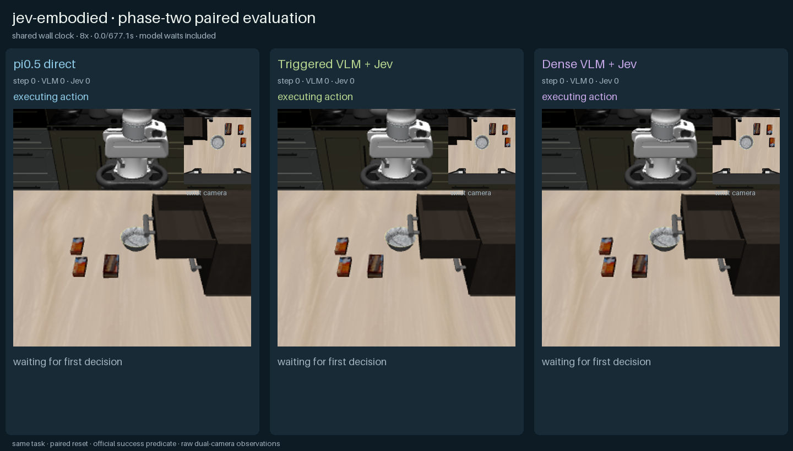
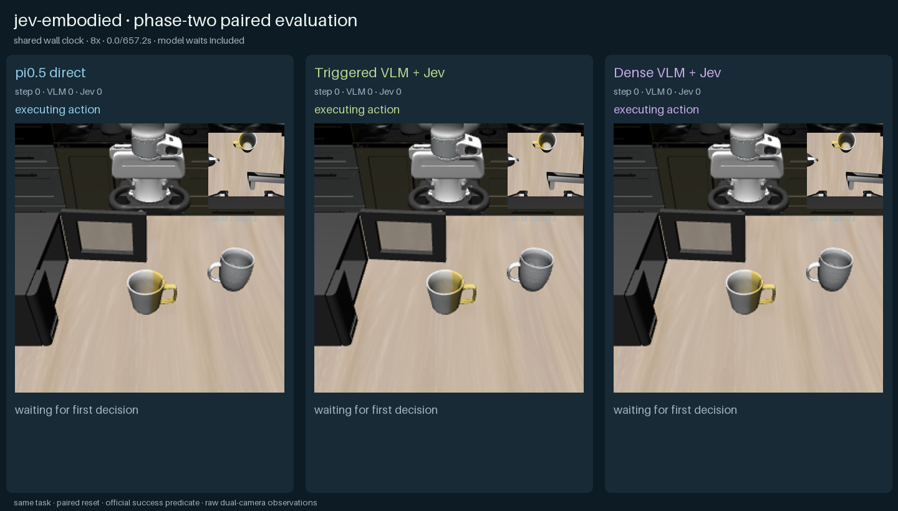

# 二阶段：π0.5 与 Qwen3.5 + Jev

实验日期为 2026-10-04。本轮在双卡 H20 服务器上运行 2 个 LIBERO-90 开发用例，对比三条完整系统路线：π0.5 直接生成连续动作块、Qwen3.5 按需规划后由 Jev 选择动作，以及每轮都由 Qwen3.5 重新规划后由 Jev 选择动作。所有路线共享任务、初始状态、双相机、400 步上限和 LIBERO 官方成功判定。

## 结论

π0.5 在关闭微波炉任务成功，在关闭抽屉任务失败，总计 1/2；两条 Qwen3.5 + Jev 路线均为 0/2。按需调度相对逐轮调度减少 59.4% 的 VLM 请求，并将平均端到端时间降低 48.7%，但本轮没有转化为成功率提升。视频显示混合路线未稳定建立有效接触，说明当前瓶颈主要在候选动作抽象与闭环接触控制，而不只是规划调用频率。

这只是 2 个固定初始状态的开发实验，不是 LIBERO 榜单结果，也不足以推断方法的普遍成功率。π0.5 与混合路线使用不同动作抽象，因此这里比较的是完整系统，而不是单个模型的等价能力。

## 汇总

| 路线 | 成功 | 平均环境步 | 平均墙钟时间 | VLM 请求 | Jev 请求 |
|---|---:|---:|---:|---:|---:|
| π0.5 直接动作 | 1/2 | 326.5 | 67.02 s | 0 | 0 |
| Qwen3.5 + Jev，按需规划 | 0/2 | 400 | 345.08 s | 65 | 173 |
| Qwen3.5 + Jev，逐轮规划 | 0/2 | 400 | 673.10 s | 160 | 160 |

按需路线的 13 次额外 Jev 请求来自低置信选择后的重新规划与重选，而不是多执行了环境动作。π0.5 共进行 131 次动作块推理，平均延迟 76.34 ms，中位数 76.13 ms。

## 逐局结果

| 任务 | 路线 | 结果 | 步数 | 墙钟时间 | VLM / Jev |
|---|---|---:|---:|---:|---:|
| `close the top drawer of the cabinet` | π0.5 | 失败 | 400 | 80.47 s | 0 / 0 |
| 同上 | 按需 Qwen3.5 + Jev | 失败 | 400 | 368.35 s | 36 / 84 |
| 同上 | 逐轮 Qwen3.5 + Jev | 失败 | 400 | 682.92 s | 80 / 80 |
| `close the microwave` | π0.5 | 成功 | 253 | 53.58 s | 0 / 0 |
| 同上 | 按需 Qwen3.5 + Jev | 失败 | 400 | 321.82 s | 29 / 89 |
| 同上 | 逐轮 Qwen3.5 + Jev | 失败 | 400 | 663.29 s | 80 / 80 |

### 关闭抽屉

[共享墙钟视频](media/drawer-init0/comparison.mp4) · [末帧](media/drawer-init0/final.png)

### 关闭微波炉

[共享墙钟视频](media/microwave-init0/comparison.mp4) · [末帧](media/microwave-init0/final.png)

视频按真实墙钟时间对齐并以 8× 播放，模型等待时间包含在时间轴中。两段 MP4 分别完整解码为 1040 帧和 1010 帧，SHA-256 见 [`metrics.json`](metrics.json)。

## 按需调度发生了什么

按需路线保存 Qwen3.5 的短期计划和候选动作，由 Jev 连续选择。仅在首次观察、计划期限到达、本体状态停滞，或 Jev 的选择概率、最高概率、前两名差值、归一化熵越过阈值时重做视觉规划。

- 抽屉：36 次 VLM 规划；触发中包含停滞 25 次、计划到期 9 次，以及若干低置信条件；4 次 Jev 重选。
- 微波炉：29 次 VLM 规划；触发中包含计划到期 14 次、低 margin 9 次、停滞 5 次；9 次 Jev 重选。
- 逐轮路线在两个任务中都固定进行了 80 次 VLM 规划。

按需调度确实实现了“VLM 必要时规划、Jev 大部分时候从缓存候选中决策”的目标，但候选集合仍主要是笛卡尔小位移、旋转和夹爪动作。它缺少 π0.5 连续动作块中隐含的接触轨迹，因而降低规划成本并没有自动解决操作成功率。

## 模型、费用与复现边界

- 本地 VLM：`Qwen/Qwen3.5-27B`，revision `fc05daec18b0a78c049392ed2e771dde82bdf654`，vLLM 0.30.0，BF16，`max-model-len=8192`，`max-num-seqs=8`，关闭 thinking。
- VLA：官方 `pi05_libero` checkpoint，通过 openpi policy server 推理；恢复的 openpi 源码归档没有 `.git`，只能确认包版本记录为 0.1.0，无法从该归档还原精确 commit。这是本轮复现限制。
- Jev：远端 `jev-1.13.0`；没有调用远端 GPT。Jev 输入按 `$0.042 / 1M tokens` 估算，按需路线为 `$0.011065`，逐轮路线为 `$0.010193`。本地 H20 计算成本未计入，Qwen 本地推理不记作 API 费用。
- 执行：LIBERO/robosuite 1.4.1，OSC_POSE 20 Hz；每次策略决策最多执行 5 个环境步。
- 配对：每个任务三条路线的 `initial_fingerprint` 完全一致；6 局均正常结束，无设置或运行错误。

完整协议见 [`protocol.json`](protocol.json)，精简机器可读结果见 [`metrics.json`](metrics.json)。含逐请求记录和全部原始相机帧的 5 MB 报告保留在服务器：`/mnt/oss/users/zyh/runs/phase2-qwen35-dev-20261004`。

## 完整性检查

- 6/6 局完成并进入统计，配对初始指纹一致。
- 共记录 2259 个时间点、4518 张双相机帧。
- 正式 JSON/JSONL 已扫描，不含 API key 或常见凭据字段值。
- 两段正式 MP4 下载前后哈希一致，并在本机完成全帧解码。
